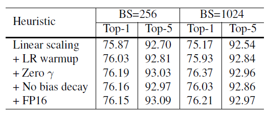

# Bag of Tricks for Image Classification with Convolutional Neural Networks

这篇文章来自李沐大神团队，使用各种CNN tricks，将原始的resnet在imagenet上提升了四个点。记录一下，可以用到自己的网络上。

## baseline

**model**: resnet50

transform部分使用pytorch的torchvision接口

**train transform:**

1. transforms.RandomResizedCrop(224)
2. transforms.RandomHorizontalFlip(0.5)
3. transforms.ColorJitter(brightness=0.4, ntrast=0.4, saturation=0.4)
4. PCA noise ——— normal distribution N(0, 0.1)
5. transforms.Normalize(mean=[0.485, 0.456, 0.406], std=[0.229, 0.224, 0.225])

**val transform**: 

1. transforms.Resize(256)
2. transforms.CenterCrop(224)

**parameters initialized**: 

conv and lr: Xavier uniformly [-a, a], a = $\sqrt{6 /\left(d_{i n}+d_{o u t}\right)}$，$d_{in}$ and $d_{out}$ are the input and output channel sizes
bn: $\gamma$ = 1, $\beta$ = 0

**optimizer**：NAG
**epoch**：120
**lr**: 0.1, divided by 10 every 30 epochs
**batchsize**: 256

## Tricks

### Efficient Training

**Large batch training**：

1. 大的batch减小了梯度的噪声，可以适当放大学习率。论文中调整为0.1 X b/256.
2. 网络初始的时候，参数离目标很远，较大的学习率会发生数值不稳定，应使用较小的学习线性递增到设置的lr，比如m个batch（5个epoch），初始学习率为n，第i个batch的学习率为i*n/m.
3. 把每一个resnet block最后一个bn层的$\gamma$设置为0
4. 只有weight decay，没有bias decay

**Low precision training**：

将FP32换成FP16可以不丧失精度使训练更快，技巧是存储所有参数和激活使用FP16来计算梯度。同时，FP32中的所有参数都有一个副本，用于参数更新。

**result**：

efficient是bs1024 + FP16的结果，更快更好。

以下是加上五个变量的实验结果，加入LR warmup和Zero $\gamma$效果明显，另外两个作用不是很大。

### Model Tweaks

文章对原始的resnet block的下采样层进行了改动，共有三个版本。

以下是原始的resnet结构图：

三个版本对downsample的改动如下：

**Resnet-B**: 原始的downsample是在conv1x1进行stride为2的下采样，这样会损失3/4的信息，resnet-B则不会。

**Resnet-C**: 这个调整最早来自于Inception-v2，引入1x1可以减小计算量和参数，作者将前两层的输出通道变为32来达到减小计算量的效果。

**Resnet-D**: resnet-b的pathB分支还是会损失3/4的信息，通过引入avgpool来改善这种影响。

**result**：

略微提高计算量，Resnet-D版本差不多提高一个点。

### Training Refinements

**Cosine Learning Rate Decay**：

将学习率变为余弦函数的曲线，公式如下：
$$
\eta_{t}=\frac{1}{2}\left(1+\cos \left(\frac{t \pi}{T}\right)\right) \eta
$$
$n$是初始学习率，t是第t个batch，T是总batch数，与stepLR的曲线如下所示，开始的直线是LR warmup，可以看到余弦退火精度要高一些：

**label smooth**：原始的label是one-hot标签，过于苛刻，label smooth将标签进行软化，其他类别也需要有低的概率，变为如下所示的公式，一般$\varepsilon$的取值为0.1.
$$
q_{i}=\left\{\begin{array}{ll}{1-\varepsilon} & {\text { if } i=y} \\ {\varepsilon /(K-1)} & {\text { otherwise }}\end{array}\right.
$$
**Knowledge Distillation**：知识蒸馏是使用一个老师模型来训练当前模型，帮助当前模型训练的更好，老师模型一般使用精确度更好的预训练模型，文章是使用Resnet152作为老师模型来训练resnet50，通过约束当前模型的softmax输出与老师模型保持一致来提高当前模型。所以损失函数变成下面的形式：
$$
\ell(p, \operatorname{softmax}(z))+T^{2} \ell(\operatorname{softmax}(r / T), \operatorname{softmax}(z / T))
$$
**Mixup Training**：这是一种新式的数据增强策略，随机采样两个样本（可不同类别），进行权重插值（x是图像，y是标签），公式如下：
$$
\begin{aligned} \hat{x} &=\lambda x_{i}+(1-\lambda) x_{j} \\ \hat{y} &=\lambda y_{i}+(1-\lambda) y_{j} \end{aligned}
$$
$\lambda$的范围是0到1，一般采样beta分布。

**result**：

可以看到cosine decay，label smooth和mixup还是很有用的，对模型提高不少，但Knowledge Distillation不同模型效果不同，还得进行实验。

### 参考

1. https://arxiv.org/abs/1812.01187

