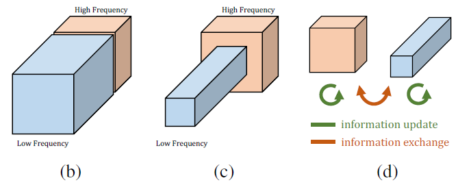
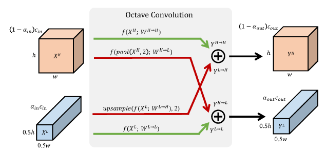
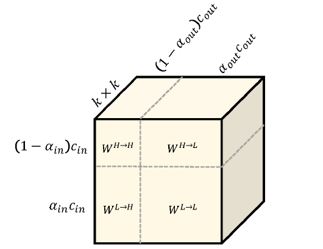

# Octave Convolution详解

## 前言

**Octave Convolution**来自于这篇论文**《[Drop an Octave: Reducing Spatial Redundancy in Convolutional Neural Networks with Octave Convolution](https://arxiv.org/abs/1904.05049)》**这篇论文，该论文也被**ICCV2019**接收。

Octave表示的是音阶的八度，而本篇核心思想是通过对数据低频信息减半从而达到加速卷积运算的目的，而两个Octave之间也是声音频率减半【2】。

Octave Convolution（后面将以**OctConv**命名）主要有以下三个贡献：

- 将卷积特征图分成了两组，一组低频，一组高频，低频特征图的大小会减半，从而可以有效减少存储以及计算量，另外，由于特征图大小减小，卷积核大小不变，感受野就变大了，可以抓取更多的上下文信息；
- OctConv是一种即插即用的卷积块，可以直接替换传统的conv（也替换分组卷积以及深度可分离卷积等），减小内存和计算量；
- 当然，作者做了大量实验，使用OctConv可以得到更高性能，甚至可以媲美best Auto ML。

总的来说，OctConv是占用内存小，速度快，性能高，即插即用的conv块。

## OctConv的特征表示

自然图像可被分解为低频分量以及高频分量，如下所示：


而卷积层的特征图也可以分为低频和高频分量，如下图(b)所示，OctConv卷积的做法是将低频分量的空间分辨率减半（如下图c所示），然后分两组进行conv，两组频率之间会通过上采样和下采样进行信息交互（见下图d），最后再合成原始特征图大小。



作者认为低频分量在一些特征图中是富集的，可以被压缩的，所以对低频分量进行了压缩，压缩的方式没有采用stride conv，而是使用了average pooling，因为stride conv会导致不对齐的行为。

## OctConv的详细过程



如上图所示，OctConv的输入有两部分，一部分是高频$X^H$，另一部分是低频$X^L$，观察到$X^L$的大小是$X^H$的二分之一，这里通过两个参数$\alpha_{in}$和$\alpha_{out}$来控制低高频的输入通道和输出通道，一开始，输入只有一个$X$，这时候的$\alpha_{in}$为0，然后通过两个卷积层（$f\left(X^{H} ; W^{H \rightarrow H}\right)$和$f\left(p o o l\left(X^{H}, 2\right) ; W^{H \rightarrow L}\right)$）得到高频分量和低频分量，中间的OctConv就是有两个输入了和两个输出，最后需要从两个输入恢复出一个输出，此时$\alpha_{out}$为0，通过$f\left(X^{H} ; W^{H \rightarrow H}\right)$和$upsample\left(f\left(X^{L} ; W^{L \rightarrow H}\right), 2\right)$两个操作得到单独输出。

现在来讨论上面的四根线上的操作各代表什么。

$f\left(X^{H} ; W^{H \rightarrow H}\right)$是高频信息到高频信息，通过一个卷积层即可。

$f\left(p o o l\left(X^{H}, 2\right) ; W^{H \rightarrow L}\right)$是将高频信息汇合到低频信息中，先通过一个平均池化，然后通过一个卷积层。

$upsample\left(f\left(X^{L} ; W^{L \rightarrow H}\right), 2\right)$是将低频信息汇合到高频信息，先通过一个卷积层，然后通过平均池化层。

$f\left(X^{L} ; W^{L \rightarrow L}\right)$是将低频信息到低频信息，通过一个卷积层。

现在看看卷积核参数分配的问题，如下图所示：



上面的四个操作对应上图的四个部分，可以看到总的参数依然是$c_{i n} \times c_{o u t} \times k \times k$，但由于低频分量的尺寸减半，所需要的存储空间变小，以及计算量缩减，达到加速卷积的过程。

## Pytorch代码

下面的代码来自于[OctaveConv_pytorch](https://github.com/lxtGH/OctaveConv_pytorch/blob/master/libs/nn/OctaveConv2.py) ，代码可读性很高，如果理解了上述过程，看起来会很容易。

第一层OctConv卷积，将特征图x分为高频和低频：

```python
class FirstOctaveConv(nn.Module):
    def __init__(self, in_channels, out_channels,kernel_size, alpha=0.5, stride=1, padding=1, dilation=1,
                 groups=1, bias=False):
        super(FirstOctaveConv, self).__init__()
        self.stride = stride
        kernel_size = kernel_size[0]
        self.h2g_pool = nn.AvgPool2d(kernel_size=(2, 2), stride=2)
        self.h2l = torch.nn.Conv2d(in_channels, int(alpha * out_channels),
                                   kernel_size, 1, padding, dilation, groups, bias)
        self.h2h = torch.nn.Conv2d(in_channels, out_channels - int(alpha * out_channels),
                                   kernel_size, 1, padding, dilation, groups, bias)

    def forward(self, x):
        if self.stride ==2:
            x = self.h2g_pool(x)

        X_h2l = self.h2g_pool(x)
        X_h = x
        X_h = self.h2h(X_h)
        X_l = self.h2l(X_h2l)

        return X_h, X_l

```

中间层的OctConv，低高频输入，低高频输出：

```python
class OctaveConv(nn.Module):
    def __init__(self, in_channels, out_channels, kernel_size, alpha=0.5, stride=1, padding=1, dilation=1,
                 groups=1, bias=False):
        super(OctaveConv, self).__init__()
        kernel_size = kernel_size[0]
        self.h2g_pool = nn.AvgPool2d(kernel_size=(2, 2), stride=2)
        self.upsample = torch.nn.Upsample(scale_factor=2, mode='nearest')
        self.stride = stride
        self.l2l = torch.nn.Conv2d(int(alpha * in_channels), int(alpha * out_channels),
                                   kernel_size, 1, padding, dilation, groups, bias)
        self.l2h = torch.nn.Conv2d(int(alpha * in_channels), out_channels - int(alpha * out_channels),
                                   kernel_size, 1, padding, dilation, groups, bias)
        self.h2l = torch.nn.Conv2d(in_channels - int(alpha * in_channels), int(alpha * out_channels),
                                   kernel_size, 1, padding, dilation, groups, bias)
        self.h2h = torch.nn.Conv2d(in_channels - int(alpha * in_channels),
                                   out_channels - int(alpha * out_channels),
                                   kernel_size, 1, padding, dilation, groups, bias)

    def forward(self, x):
        X_h, X_l = x

        if self.stride ==2:
            X_h, X_l = self.h2g_pool(X_h), self.h2g_pool(X_l)

        X_h2l = self.h2g_pool(X_h)

        X_h2h = self.h2h(X_h)
        X_l2h = self.l2h(X_l)

        X_l2l = self.l2l(X_l)
        X_h2l = self.h2l(X_h2l)
        
        X_l2h = self.upsample(X_l2h)
        X_h = X_l2h + X_h2h
        X_l = X_h2l + X_l2l

        return X_h, X_l
```

最后一层的OctConv，将低高频汇合称输出。

```python
class LastOctaveConv(nn.Module):
    def __init__(self, in_channels, out_channels, kernel_size, alpha=0.5, stride=1, padding=1, dilation=1,
                 groups=1, bias=False):
        super(LastOctaveConv, self).__init__()
        self.stride = stride
        kernel_size = kernel_size[0]
        self.h2g_pool = nn.AvgPool2d(kernel_size=(2,2), stride=2)

        self.l2h = torch.nn.Conv2d(int(alpha * in_channels), out_channels,
                                   kernel_size, 1, padding, dilation, groups, bias)
        self.h2h = torch.nn.Conv2d(in_channels - int(alpha * in_channels),
                                   out_channels,
                                   kernel_size, 1, padding, dilation, groups, bias)
        self.upsample = torch.nn.Upsample(scale_factor=2, mode='nearest')

    def forward(self, x):
        X_h, X_l = x

        if self.stride ==2:
            X_h, X_l = self.h2g_pool(X_h), self.h2g_pool(X_l)

        X_l2h = self.l2h(X_l)
        X_h2h = self.h2h(X_h)
        X_l2h = self.upsample(X_l2h)
        
        X_h = X_h2h + X_l2h

        return X_h
```

## 参考

【1】 **[Octave Convolution论文](https://arxiv.org/abs/1904.05049)**

【2】[Pytorch代码](https://github.com/lxtGH/OctaveConv_pytorch/blob/master/libs/nn/OctaveConv2.py)

【3】[Octave Convolution博客](https://blog.csdn.net/weixin_37993251/article/details/89333099)