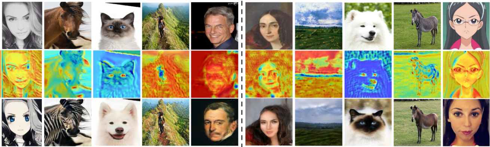
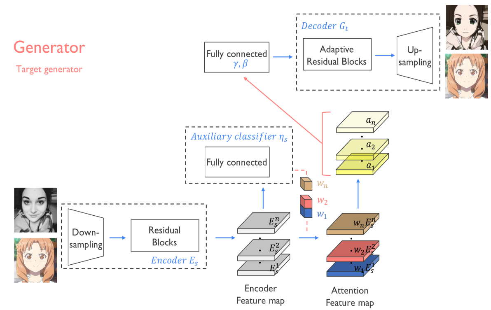
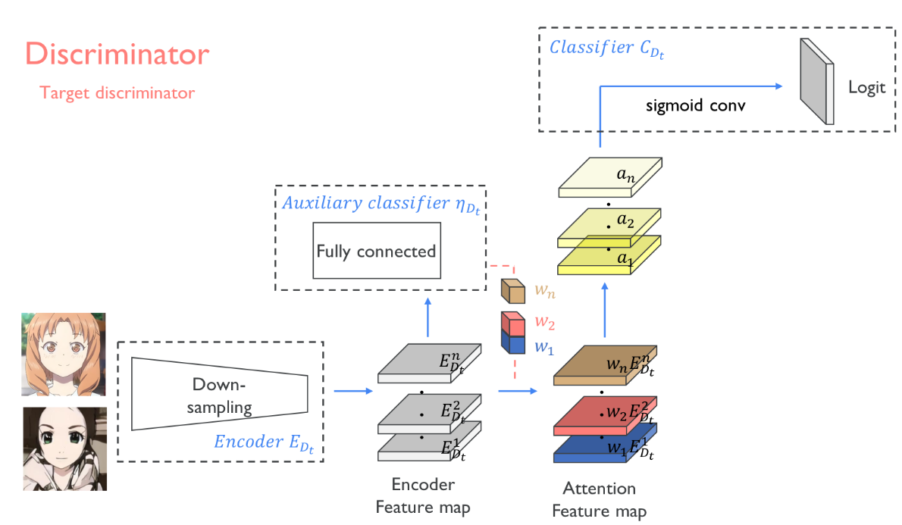

# U-GAT-IT笔记

[TOC]

## 前言

介绍一下最近出的U-GAT-IT: Unsupervised Generative Attentional Networks with Adaptive
Layer-Instance Normalization for Image-to-Image Translation，首先看看这篇论文达到的效果。



第一行是原图，第二行是热力图，第三行是生成的图像，例子中包括人脸到动漫，马到斑马，猫到狗，人脸到画等等，由于网络采用cycle-gan的形式，所以可以互转（动漫到人脸）。

这篇文章的效果和指标都很不错，值得一看，首先说说题目，可以说题目是包含了文章的主要特色。有以下几点：

- Unsupervised Generative Networks ：体现在cycle-gan的结构，不需要成对（unpair）的数据。
- Attentional：体现在有权重的特征图，具体做法是根据辅助分类器得到的注意图，通过区分源域和目标域，帮助模型知道在哪里集中转换。
- Adaptive Layer-Instance Normalization：引入了自适应的LN和IN的混合归一化层，帮助我们的注意力引导模型在不修改模型架构或超参数的情况下灵活控制形状和纹理的变化量。

## 模型结构

整个网络是类似cycle-gan的结构，AtoB和BtoA的生成器是一样的，鉴别器也是一样的，所以这里只说一个就可以了。

### 生成器



首先图像经过一个下采样模块，然后经过一个残差块，得到编码后的特征图，编码后的特征图分两路，一路是通过一个辅助分类器，得到有每个特征图的权重信息，然后与另外一路编码后的特征图相乘，得到有注意力的特征图。注意力特征图依然是分两路，一路经过一个1x1卷积和激活函数层得到黄色的a1...an特征图，然后黄色特征图通过全连接层得到解码器中 Adaptive Layer-Instance Normalization层的gamma和beta，另外一路作为解码器的输入，经过一个自适应的残差块（含有Adaptive Layer-Instance Normalization）以及上采样模块得到生成结果。

这里说一下Adaptive Layer-Instance Normalization的具体公式：
$$
\hat{a}_{I}=\frac{a-\mu_{I}}{\sqrt{\sigma_{I}^{2}+\epsilon}}, \hat{a}_{L}=\frac{a-\mu_{L}}{\sqrt{\sigma_{L}^{2}+\epsilon}}
$$
上面是IN和LN的归一化公式，然后将$\hat{a}_{I}$和$\hat{a}_{L}$代入到进行合并（$\gamma$和$\beta$通过外部传入）：
$$
\operatorname{AdaLIN}(a, \gamma, \beta)=\gamma \cdot\left(\rho \cdot \hat{a}_{I}+(1-\rho) \cdot \hat{a}_{L}\right)+\beta
$$
为了防止$\rho$超出[0,1]范围，对$\rho$进行了区间裁剪：
$$
\rho \leftarrow c l i p[0,1](\rho-\tau \Delta \rho)
$$
AdaIN能很好的将内容特征转移到样式特征上，但AdaIN假设特征通道之间不相关，意味着样式特征需要包括很多的内容模式，而LN则没有这个假设，但LN不能保持原始域的内容结构，因为LN考虑的是全局统计信息，所以作者将AdaIN和LN结合起来，结合两者的优势，有选择地保留或改变内容信息，有助于解决广泛的图像到图像的翻译问题。

当然，说的再多，看源码是最直观，最清楚的，附上注解后的[pytorch官方源码](https://github.com/znxlwm/UGATIT-pytorch)。

```python
class ResnetGenerator(nn.Module):
    def __init__(self, input_nc, output_nc, ngf=64, n_blocks=6, img_size=256, light=False):
        assert(n_blocks >= 0)
        super(ResnetGenerator, self).__init__()
        self.input_nc = input_nc    #输入通道数 --> 3
        self.output_nc = output_nc  #输出通道数 --> 3
        self.ngf = ngf              #第一层卷积后的通道数 --> 64
        self.n_blocks = n_blocks	#残差块数 --> 6
        self.img_size = img_size    #图像size --> 256
        self.light = light          #是否使用轻量级模型

        DownBlock = []
        # 先通过一个卷积核尺寸为7的卷积层，图片大小不变，通道数变为64
        DownBlock += [nn.ReflectionPad2d(3),
                      nn.Conv2d(input_nc, ngf, kernel_size=7, stride=1, padding=0, bias=False),
                      nn.InstanceNorm2d(ngf),
                      nn.ReLU(True)]

        # Down-Sampling --> 下采样模块
        n_downsampling = 2
        # 两层下采样，img_size缩小4倍（64），通道数扩大4倍（256）
        for i in range(n_downsampling): 
            mult = 2**i
            DownBlock += [nn.ReflectionPad2d(1),
                          nn.Conv2d(ngf * mult, ngf * mult * 2, kernel_size=3, stride=2, padding=0, bias=False),
                          nn.InstanceNorm2d(ngf * mult * 2),
                          nn.ReLU(True)]

        # Down-Sampling Bottleneck  --> 编码器中的残差模块
        mult = 2**n_downsampling
        # 6个残差块，尺寸和通道数都不变
        for i in range(n_blocks):
            DownBlock += [ResnetBlock(ngf * mult, use_bias=False)]

        # Class Activation Map --> 产生类别激活图
        #接着global average pooling后的全连接层
        self.gap_fc = nn.Linear(ngf * mult, 1, bias=False)
        #接着global max pooling后的全连接层
        self.gmp_fc = nn.Linear(ngf * mult, 1, bias=False)
        #下面1x1卷积和激活函数，是为了得到两个pooling合并后的特征图
        self.conv1x1 = nn.Conv2d(ngf * mult * 2, ngf * mult, kernel_size=1, stride=1, bias=True)
        self.relu = nn.ReLU(True)

        # Gamma, Beta block --> 生成自适应 L-B Normalization(AdaILN)中的Gamma, Beta
        if self.light: # 确定轻量级，FC使用的是两个256 --> 256的全连接层
            FC = [nn.Linear(ngf * mult, ngf * mult, bias=False),
                  nn.ReLU(True),
                  nn.Linear(ngf * mult, ngf * mult, bias=False),
                  nn.ReLU(True)]
        else:
            #不是轻量级，则下面的1024x1024 --> 256的全连接层和一个256 --> 256的全连接层
            FC = [nn.Linear(img_size // mult * img_size // mult * ngf * mult, ngf * mult, bias=False), # (1024x1014, 64x4) crazy
                  nn.ReLU(True),
                  nn.Linear(ngf * mult, ngf * mult, bias=False),
                  nn.ReLU(True)]
        #AdaILN中的Gamma, Beta
        self.gamma = nn.Linear(ngf * mult, ngf * mult, bias=False)
        self.beta = nn.Linear(ngf * mult, ngf * mult, bias=False)
		
        # Up-Sampling Bottleneck --> 解码器中的自适应残差模块
        for i in range(n_blocks):
            setattr(self, 'UpBlock1_' + str(i+1), ResnetAdaILNBlock(ngf * mult, use_bias=False))

        # Up-Sampling --> 解码器中的上采样模块
        UpBlock2 = []
        #上采样与编码器的下采样对应
        for i in range(n_downsampling):
            mult = 2**(n_downsampling - i)
            UpBlock2 += [nn.Upsample(scale_factor=2, mode='nearest'),
                         nn.ReflectionPad2d(1),
                         nn.Conv2d(ngf * mult, int(ngf * mult / 2), kernel_size=3, stride=1, padding=0, bias=False),
                         ILN(int(ngf * mult / 2)), #注:只有自适应残差块使用AdaILN
                         nn.ReLU(True)]
		#最后一层卷积层，与最开始的卷积层对应
        UpBlock2 += [nn.ReflectionPad2d(3),
                     nn.Conv2d(ngf, output_nc, kernel_size=7, stride=1, padding=0, bias=False),
                     nn.Tanh()]
		
        self.DownBlock = nn.Sequential(*DownBlock) #编码器整个模块
        self.FC = nn.Sequential(*FC)               #生成gamma,beta的全连接层模块
        self.UpBlock2 = nn.Sequential(*UpBlock2)   #只包含上采样后的模块，不包含残差块

    def forward(self, input):
        x = self.DownBlock(input)  #得到编码器的输出,对应途中encoder feature map

        gap = torch.nn.functional.adaptive_avg_pool2d(x, 1) #全局平均池化
        gap_logit = self.gap_fc(gap.view(x.shape[0], -1)) #gap的预测
        gap_weight = list(self.gap_fc.parameters())[0] #self.gap_fc的权重参数
        gap = x * gap_weight.unsqueeze(2).unsqueeze(3) #得到全局平均池化加持权重的特征图

        gmp = torch.nn.functional.adaptive_max_pool2d(x, 1) #全局最大池化
        gmp_logit = self.gmp_fc(gmp.view(x.shape[0], -1)) #gmp的预测
        gmp_weight = list(self.gmp_fc.parameters())[0] #self.gmp_fc的权重参数
        gmp = x * gmp_weight.unsqueeze(2).unsqueeze(3) #得到全局最大池化加持权重的特征图

        cam_logit = torch.cat([gap_logit, gmp_logit], 1) #结合gap和gmp的cam_logit预测
        x = torch.cat([gap, gmp], 1)  #结合两种池化后的特征图，通道数512
        x = self.relu(self.conv1x1(x)) #接入一个卷积层，通道数512转换为256

        heatmap = torch.sum(x, dim=1, keepdim=True) #得到注意力热力图

        if self.light:
            x_ = torch.nn.functional.adaptive_avg_pool2d(x, 1) #轻量级则先经过一个gap
            x_ = self.FC(x_.view(x_.shape[0], -1))
        else:
            x_ = self.FC(x.view(x.shape[0], -1))
        gamma, beta = self.gamma(x_), self.beta(x_) #得到自适应gamma和beta


        for i in range(self.n_blocks):
            #将自适应gamma和beta送入到AdaILN
            x = getattr(self, 'UpBlock1_' + str(i+1))(x, gamma, beta)
        out = self.UpBlock2(x) #通过上采样后的模块，得到生成结果

        return out, cam_logit, heatmap #模型输出为生成结果，cam预测以及热力图


class ResnetBlock(nn.Module): #编码器中的残差块
    def __init__(self, dim, use_bias):
        super(ResnetBlock, self).__init__()
        conv_block = []
        conv_block += [nn.ReflectionPad2d(1),
                       nn.Conv2d(dim, dim, kernel_size=3, stride=1, padding=0, bias=use_bias),
                       nn.InstanceNorm2d(dim),
                       nn.ReLU(True)]

        conv_block += [nn.ReflectionPad2d(1),
                       nn.Conv2d(dim, dim, kernel_size=3, stride=1, padding=0, bias=use_bias),
                       nn.InstanceNorm2d(dim)]

        self.conv_block = nn.Sequential(*conv_block)

    def forward(self, x):
        out = x + self.conv_block(x)
        return out


class ResnetAdaILNBlock(nn.Module): #解码器中的自适应残差块
    def __init__(self, dim, use_bias):
        super(ResnetAdaILNBlock, self).__init__()
        self.pad1 = nn.ReflectionPad2d(1)
        self.conv1 = nn.Conv2d(dim, dim, kernel_size=3, stride=1, padding=0, bias=use_bias)
        self.norm1 = adaILN(dim)
        self.relu1 = nn.ReLU(True)

        self.pad2 = nn.ReflectionPad2d(1)
        self.conv2 = nn.Conv2d(dim, dim, kernel_size=3, stride=1, padding=0, bias=use_bias)
        self.norm2 = adaILN(dim)

    def forward(self, x, gamma, beta):
        out = self.pad1(x)
        out = self.conv1(out)
        out = self.norm1(out, gamma, beta)
        out = self.relu1(out)
        out = self.pad2(out)
        out = self.conv2(out)
        out = self.norm2(out, gamma, beta)

        return out


class adaILN(nn.Module): #Adaptive Layer-Instance Normalization代码
    def __init__(self, num_features, eps=1e-5):
        super(adaILN, self).__init__()
        self.eps = eps
        #adaILN的参数p，通过这个参数来动态调整LN和IN的占比
        self.rho = Parameter(torch.Tensor(1, num_features, 1, 1)) 
        self.rho.data.fill_(0.9)

    def forward(self, input, gamma, beta):
        #先求两种规范化的值
        in_mean, in_var = torch.mean(torch.mean(input, dim=2, keepdim=True), dim=3, keepdim=True), torch.var(torch.var(input, dim=2, keepdim=True), dim=3, keepdim=True)
        out_in = (input - in_mean) / torch.sqrt(in_var + self.eps)
        ln_mean, ln_var = torch.mean(torch.mean(torch.mean(input, dim=1, keepdim=True), dim=2, keepdim=True), dim=3, keepdim=True), torch.var(torch.var(torch.var(input, dim=1, keepdim=True), dim=2, keepdim=True), dim=3, keepdim=True)
        out_ln = (input - ln_mean) / torch.sqrt(ln_var + self.eps)
        #合并两种规范化(IN, LN)
        out = self.rho.expand(input.shape[0], -1, -1, -1) * out_in + (1-self.rho.expand(input.shape[0], -1, -1, -1)) * out_ln 
        #扩张得到结果
        out = out * gamma.unsqueeze(2).unsqueeze(3) + beta.unsqueeze(2).unsqueeze(3)
		
        return out


class ILN(nn.Module): #没有加入自适应的Layer-Instance Normalization，用于上采样
    def __init__(self, num_features, eps=1e-5):
        super(ILN, self).__init__()
        self.eps = eps
        self.rho = Parameter(torch.Tensor(1, num_features, 1, 1))
        self.gamma = Parameter(torch.Tensor(1, num_features, 1, 1))
        self.beta = Parameter(torch.Tensor(1, num_features, 1, 1))
        self.rho.data.fill_(0.0)
        self.gamma.data.fill_(1.0)
        self.beta.data.fill_(0.0)

    def forward(self, input):
        in_mean, in_var = torch.mean(torch.mean(input, dim=2, keepdim=True), dim=3, keepdim=True), torch.var(torch.var(input, dim=2, keepdim=True), dim=3, keepdim=True)
        out_in = (input - in_mean) / torch.sqrt(in_var + self.eps)
        ln_mean, ln_var = torch.mean(torch.mean(torch.mean(input, dim=1, keepdim=True), dim=2, keepdim=True), dim=3, keepdim=True), torch.var(torch.var(torch.var(input, dim=1, keepdim=True), dim=2, keepdim=True), dim=3, keepdim=True)
        out_ln = (input - ln_mean) / torch.sqrt(ln_var + self.eps)
        out = self.rho.expand(input.shape[0], -1, -1, -1) * out_in + (1-self.rho.expand(input.shape[0], -1, -1, -1)) * out_ln
        out = out * self.gamma.expand(input.shape[0], -1, -1, -1) + self.beta.expand(input.shape[0], -1, -1, -1)

        return out
```

生成器的代码如上，归结下来有以下几个点：

- 编码器中没有采用AdaILN以及ILN,而且只采用了IN，原文给出了解释：在分类问题中，LN的性能并不比批规范化好，由于辅助分类器与生成器中的编码器连接，为了提高辅助分类器的精度，我们使用实例规范化(批规范化，小批量大小为1)代替AdaLIN；
- 使用类别激活图(CAM)来得到注意力权重；
- 通过注意力特征图得到解码器中AdaILN的gamma和beta；
- 解码器中残差块使用的AdaILN，而其他块使用的是ILN；
- 使用镜像填充，而不是0填充；
- 所有激活函数使用的是RELU。

### 鉴别器

鉴别器相比生成器，要简单许多，结构图如下所示：



具体结构与生成器类似，不过规范化使用的是谱规范化，使训练更加稳定，收敛得更好，激活函数使用的是leakyrelu，直接上代码：

```python
class Discriminator(nn.Module):
    def __init__(self, input_nc, ndf=64, n_layers=5):
        super(Discriminator, self).__init__()
        model = [nn.ReflectionPad2d(1),   #第一层下采样, 尺寸减半(128)，通道数为64
                 nn.utils.spectral_norm(
                 nn.Conv2d(input_nc, ndf, kernel_size=4, stride=2, padding=0, bias=True)),
                 nn.LeakyReLU(0.2, True)]

        for i in range(1, n_layers - 2): #第二，三层下采样，尺寸再缩4倍(32)，通道数为256
            mult = 2 ** (i - 1)
            model += [nn.ReflectionPad2d(1),
                      nn.utils.spectral_norm(
                      nn.Conv2d(ndf * mult, ndf * mult * 2, kernel_size=4, stride=2, padding=0, bias=True)),
                      nn.LeakyReLU(0.2, True)]

        mult = 2 ** (n_layers - 2 - 1)
        model += [nn.ReflectionPad2d(1), # 尺寸不变（32），通道数为512
                  nn.utils.spectral_norm(
                  nn.Conv2d(ndf * mult, ndf * mult * 2, kernel_size=4, stride=1, padding=0, bias=True)),
                  nn.LeakyReLU(0.2, True)]

        # Class Activation Map， 与生成器得类别激活图类似
        mult = 2 ** (n_layers - 2)
        self.gap_fc = nn.utils.spectral_norm(nn.Linear(ndf * mult, 1, bias=False))
        self.gmp_fc = nn.utils.spectral_norm(nn.Linear(ndf * mult, 1, bias=False))
        self.conv1x1 = nn.Conv2d(ndf * mult * 2, ndf * mult, kernel_size=1, stride=1, bias=True)
        self.leaky_relu = nn.LeakyReLU(0.2, True)

        self.pad = nn.ReflectionPad2d(1)
        self.conv = nn.utils.spectral_norm(
            nn.Conv2d(ndf * mult, 1, kernel_size=4, stride=1, padding=0, bias=False))

        self.model = nn.Sequential(*model)

    def forward(self, input):
        x = self.model(input)

        gap = torch.nn.functional.adaptive_avg_pool2d(x, 1)
        gap_logit = self.gap_fc(gap.view(x.shape[0], -1))
        gap_weight = list(self.gap_fc.parameters())[0]
        gap = x * gap_weight.unsqueeze(2).unsqueeze(3)

        gmp = torch.nn.functional.adaptive_max_pool2d(x, 1)
        gmp_logit = self.gmp_fc(gmp.view(x.shape[0], -1))
        gmp_weight = list(self.gmp_fc.parameters())[0]
        gmp = x * gmp_weight.unsqueeze(2).unsqueeze(3)

        cam_logit = torch.cat([gap_logit, gmp_logit], 1)
        x = torch.cat([gap, gmp], 1)
        x = self.leaky_relu(self.conv1x1(x))

        heatmap = torch.sum(x, dim=1, keepdim=True)

        x = self.pad(x)
        out = self.conv(x) #输出大小是32x32，其他与生成器类似

        return out, cam_logit, heatmap
```

## 损失函数

损失函数总共有四个，分别是Adversarial loss， Cycle loss， Identity loss以及CAM loss。