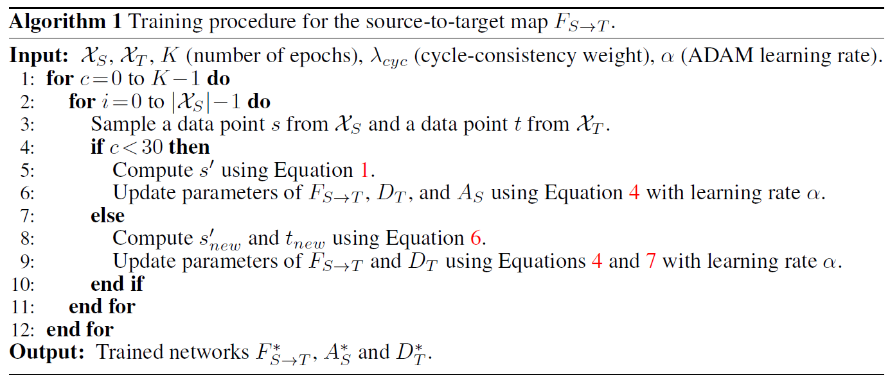

## Unsupervised Attention-guided Image-to-Image Translation

这是NeurIPS 2018一篇图像翻译的文章。目前的无监督图像到图像的翻译技术很难在不改变背景或场景中多个对象交互方式的情况下将注意力集中在改变的对象上去。这篇文章的解决思路是使用注意力导向来进行图像翻译。下面是这篇文章的结果图：

可以看到文章结果很好, 只有前景(对象)改变了, 而背景变化很小, 而其他的方法背景变化很大, 效果偏差.

现在介绍作者的方法，作者在cyclegan的基础上加入另外一个注意力网络，如下图所示：

上图的左边就是斑马转普通马的具体流程，首先$s$（斑马）会通过$F_{S \rightarrow T}$（$S$代表Source，$T$代表Target）得到普通马的预测，通知$s$还会通过一个注意力网络$A_S$得到掩模$s_a$，这个注意力层是想将前景突显出来（很大的值），背景则忽略掉（很小的值），这样与$F_{S \rightarrow T}$的输出进行按点相乘，就会只凸显出马，而背景就是很低的值，这个掩模还有用处，通过$1-s_a$可以得到只凸显背景而忽略前景的掩模，将这个掩模去与$s$相乘，得到source的背景，而其前景则被置于很低的值，然后两者进行相加，得到最终预测$s^{\prime}$。$s^{\prime}$的计算公式可由下面公式表示：
$$
s^{\prime}=\underbrace{s_{a} \odot F_{S \rightarrow T}(s)}_{\text { Foreground }}+\underbrace{\left(1-s_{a}\right) \odot s}_{\text { Background }}
$$
由于基于cyclegan，所以还需要将$s^{\prime}$转换成$s^{\prime\prime}$, 约束$s^{\prime\prime}$和$s$尽可能相似，所以还有一个普通马转斑马的过程，与斑马转普通马的过程一样，也用到了注意力网络$A_T$. 

注意力网络所生成的掩模为什么会与前景相关呢？如果不跟前景相关，根据上述公式知道，Foreground将不会凸显前景，因为掩模不跟前景相关，相乘会得到低值前景，而Background将凸显斑马的特征，相加后还是斑马，与普通马差异大，无法骗过鉴别器，所以注意力网络的掩模会学习与前景相关。

注意力网络的输出是$[0, 1]$之间的连续值，而不是二进制分割掩码，这有三点原因：

- 连续可微，可以进行训练
- 可以让注意力网络在训练过程中保持注意力的不确定性，允许收敛
- 允许网络学习如何组合边缘，否则可能会使前景对象看起来“粘在”边缘上。

现在来看看损失函数（这里只介绍$S \rightarrow T$以及$S \rightarrow T \rightarrow S$的loss，$T \rightarrow S$和$T \rightarrow S \rightarrow T$是一样的），首先是GAN固有的对抗损失：
$$
\mathcal{L}_{a d v}^{s}\left(F_{S \rightarrow T}, A_{S}, D_{T}\right)=\mathbb{E}_{t \sim P_{T}(t)}\left[\log \left(D_{T}(t)\right)\right]+\mathbb{E}_{s \sim \mathrm{P}_{S}(s)}\left[\log \left(1-D_{T}\left(s^{\prime}\right)\right)\right]
$$
然后是cyclegan中的一致性损失$S \rightarrow T \rightarrow S$, 公式如下：
$$
\mathcal{L}_{c y c}^{s}\left(s, s^{\prime \prime}\right)=\left\|s-s^{\prime \prime}\right\|_{1}
$$
总的loss为：
$$
\mathcal{L}\left(F_{S \rightarrow T}, F_{T \rightarrow S}, A_{S}, A_{T}, D_{S}, D_{T}\right)=\mathcal{L}_{a d v}^{s}+\mathcal{L}_{a d v}^{t}+\lambda_{c y c}\left(\mathcal{L}_{c y c}^{s}+\mathcal{L}_{c y c}^{t}\right)
$$
似乎到这里就结束了，其实还没有，作者发现翻译后的马现在看起来像斑马，但整体场景是假的，因为背景仍然显示了马生活在草地上的地方，而不是斑马生活在热带稀树草原上的地方，要向骗过鉴别器，注意力网络也会将背景凸显出来，这是我们不想看到的，具体事例如下图所示：

可以看到在30个epochs的时候，前景就差不多完全凸显出来了，所以作者采取了two-stage的策略，第一个stage按照上述loss训练$F_{S}, F_{T}, A_{S}, A_{T}, D_{T}, D_{S}$, 在第二个stage的时候，中断$ A_{S}, A_{T}$的训练，只训练鉴别器和生成器，当然第二个stage的loss也要变化了。

第二个stage的掩模是固定的，生成器的输出根据掩模进行了阈值处理，处理公式如下：
$$
t_{\text { new }}=\left\{\begin{array}{ll}{t} & {\text { if } A_{T}(t)>\tau} \\ {0} & {\text { otherwise }}\end{array} \quad \text { and } \qquad s_{\text { new }}^{\prime}=\left\{\begin{array}{ll}{F_{S \rightarrow T}(s)} & {\text { if } A_{S}(s)>\tau} \\ {0} & {\text { otherwise }}\end{array}\right.\right.
$$
其中$\tau$设定为0.1，对应的对抗loss的公式就变为：
$$
\mathcal{L}_{a d v}^{s}\left(F_{S \rightarrow T}, A_{S}, D_{T}\right)=\mathbb{E}_{t \sim \mathrm{P}_{T}(t)}\left[\log \left(D_{T}\left(t_{\text { new }}\right)\right)\right]+\mathbb{E}_{s \sim \mathrm{P}_{S}(s)}\left[\log \left(1-D_{T}\left(s_{\text { new }}^{\prime}\right)\right)\right)
$$
总的训练过程如下所示：

作者提出的这种方法还是有限制的，对域之间的形状更改没有鲁棒性，如下所示：

可以看到狮子转成斑马域后，狮子的毛发形状特征缺失很多，而斑马转狮子一样，没有形状细节。

总的来说，这篇文章还是挺有意思的，值得写写笔记！