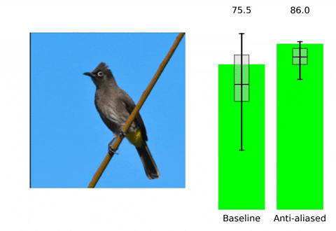
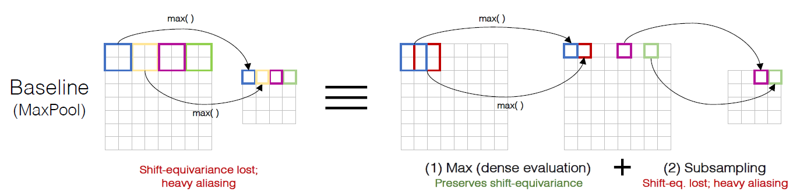
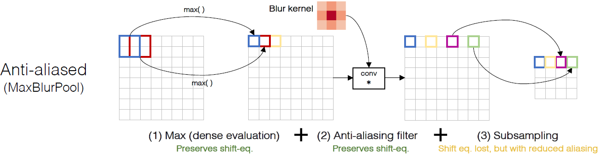
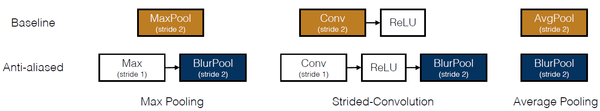
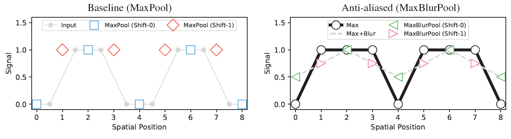
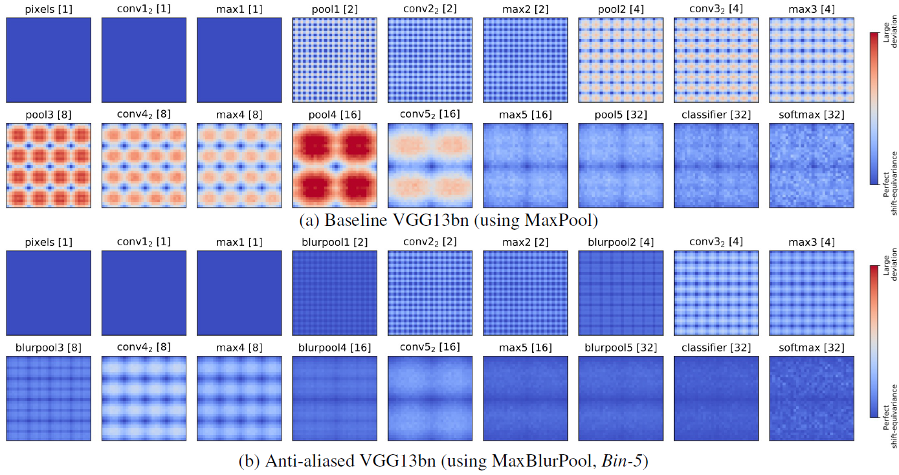
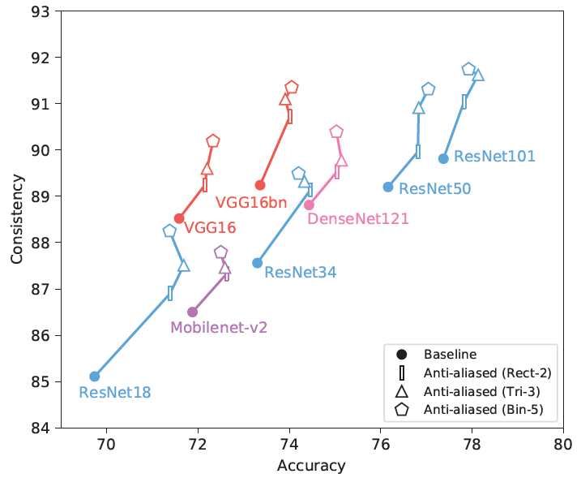
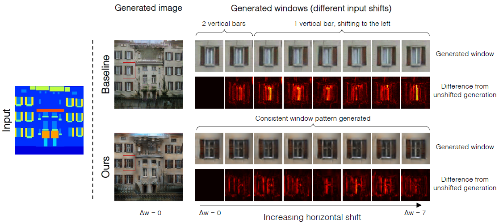

# Shift-Invariant论文笔记

[TOC]

## ICML 2019

### Making Convolutional Networks Shift-Invariant Again

什么是平移等方差（Shift-equivariance）？

答：$Shift _{\Delta h, \Delta w}(\widetilde{\mathcal{F}}(X))=\widetilde{\mathcal{F}}\left(\text { Shift }_{\Delta h, \Delta w}(X)\right) \quad \forall(\Delta h, \Delta w)$，可以看到输入在$(\Delta h, \Delta w)$变化，输出对应的输出在$(\Delta h, \Delta w)$变化。

什么是平移不变性（Shift-invariance）？

答：$\widetilde{\mathcal{F}}(X)=\widetilde{\mathcal{F}}\left(\text { Shift }_{\Delta h, \Delta w}(X)\right) \quad \forall(\Delta h, \Delta w)$， 输入在$(\Delta h, \Delta w)$变化，不改变最后的结果。

大多数现代的卷积网络是不具有平移不变性的（如上所示，右边是作者提出的方法**BlurPool**），而不具有平移不变性的原因是因为maxpooling，strided-convolution以及average-pooling这些下采样方法忽略了抽样定理，在信号处理方法中，通过在下采样前会通过一个低通滤波来消除混叠（这里的混叠是指高频分量会混叠成低频分量），然而，简单地将此模块插入深度网络会降低性能。早期确实是使用模糊下采样（average-pooling算低通滤波），但随着maxpooling的提出并表现出很大的性能，就用得不多了，通常认为模糊下采样和最大池化是相互竞争的方法，作者则展示了将两者有效地结合起来，作者把最大池化看为两步，如下所示：

最大池化第一步是先计算区域的最大值，然后进行采样，而BlurPool则将低通滤波的操作嵌入到中间，在采样前先经过一个模糊低通滤波的作用，然后采样，如下所示：

这样就将模糊下采样和最大池化相结合起来，减小了混叠效应，提升了网络的平移不变性能力。相应地，其他下采样的方法也需要变化。如下所示：

论文中举了一个事例帮助我们理解，如下图所示：

原信号是$[0,0,1,1,0,0,1,1]$，经过最大池化将得到$[0, 1, 0, 1]$（对应蓝色的小方块），但如果简单移动输入一个单位，将导致非常不同的结果（如红色的小方块所示），结果为$[1, 1, 1, 1]$，相反如果是MaxBlurPool，则不一样，原先得到的是$[.5,1, .5,1]$，平移后，得到的是$[.75, .75, .75, .75]$，它们之间的距离更近，中间信号的表示也更好。

论文中还给出了可视化的平移等方差热力图，如下所示：

蓝色表示完全平移等方差;红色表示偏差较大。原先的VGG在经过最大池化后，方差越来越大，混叠得越来越厉害，而作者提出来的方法更好地维持了平移等方差，输出结果也将更加平移不变性。

最后来看看作者最后的实验结果：

可以看到使用BlurPool，精度还上升了不少，更别说对物体平移有很强的鲁棒性了，很好的结果。上面的Rect-2，Tri-3，Bin-5是不同的卷积核，分别对应于[1, 1]，[1, 2, 1]和[1, 4, 6, 4, 1]（这里只是一维卷积，需要对自身卷积，形成二维卷积核）

更多结果：

在image-to-image任务中，对于baseline方法(顶部)，输入偏移会导致出现不同的窗口模式，而作者的方法平稳了输出，生成相同的窗口模式，对输入平移不敏感，更好。