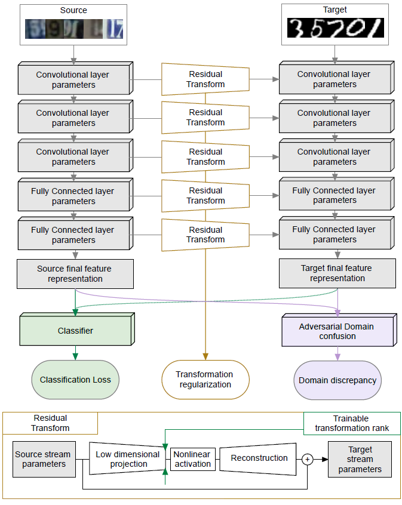
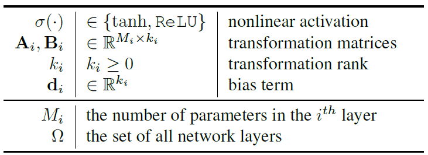
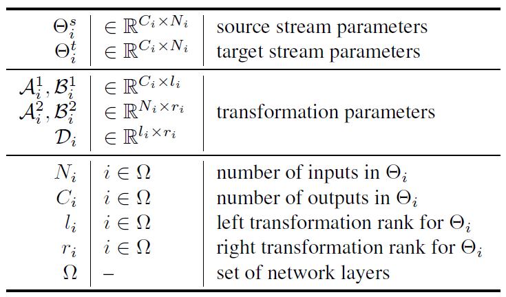
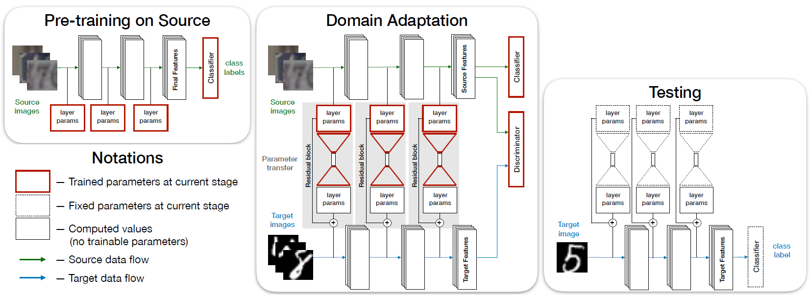

# 领域自适应笔记

领域自适应问题一般有两个域，一个是**源域**，一个是**目标域**，领域自适应可利用来自源域的带标签的数据(源域中有大量带标签的数据)来帮助学习目标域中的网络参数(目标域中很少甚至没有带标签的数据)。领域自适应如今是迁移学习的一个火热分支。

[TOC]

## CVPR2018

### Residual Parameter Transfer for Deep Domain Adaptation

这篇文章给出的是一个基于双流不共享参数的领域自适应解决方案，分为源流（source stream）和目标流（target stream） ，目标流的参数是源流的参数通过残差转换得到的，如下图所示：

下面的框给出了残差转换的具体做法，先通过一个低维映射（这个低维映射是可训练的），然后通过一个非线性激活函数，紧接着重建（重建矩阵大小是低维映射可训练权重矩阵的转置大小），最后再加上源流参数得到目标参数。可将转换过程抽象成如下公式：
$$
\theta_{i}^{t}=\mathbf{B}_{i} \sigma\left(\mathbf{A}_{i}^{\top} \theta_{i}^{s}+\mathbf{d}_{i}\right)+\theta_{i}^{s}, \quad \forall i \in \Omega
$$
其中$\Omega$是网络层的集合，$\theta_{i}^{s}$和$\theta_{i}^{t}$对应的是源域和目标域参数第$i$层的参数（对于卷积层，参数$\mathbf{W} \in \mathbb{R}^{N_{o u t} \times N_{i n} \times f_{x} \times f_{y}}$，所以$\theta_{i}^{s}$和$\theta_{i}^{t}$这里是对参数$W$进行了reshape，变为二维矩阵$N_{o u t} \times N_{i n} f_{x} f_{y}$），$\mathbf{A}_{i}^{\top}$是低维映射的矩阵，$\mathbf{B}_{i}$为重构矩阵，$\mathbf{d}_{i}$是偏置。更加具体看下图：

上述公式有一个问题，$k_{i}$（转换矩阵的秩）如果增大1，意味着多了一行，一行由$M_{i}$个元素，$A_i$和$B_i$一起就是$2M_{i}$，加上偏置就是$2M_{i}+1$, 这会$M_i$是很大的数，矩阵的秩没控制好，将会造成巨大的转换矩阵，特别是在处理全连接层的时候更加严重，作者由此提出了一个新的转换公式，公式如下：
$$
\Theta_{i}^{t}=\mathcal{B}_{i}^{1} \sigma\left(\left(\mathcal{A}_{i}^{1}\right)^{\top} \Theta_{i}^{s} \mathcal{A}_{i}^{2}+\mathcal{D}_{i}\right)\left(\mathcal{B}_{i}^{2}\right)^{\top}+\Theta_{i}^{s}
$$
与之前公式差不了多少，公式符号解释如下所示：

在激活函数内部，去除了$M_i$的维度，大大简化计算量，然后在激活函数外进行复原。原公式参数量为$\left(2 N_{i} C_{i}+1\right) k_{i}$，现在的公式参数量为$2\left(N_{i} r_{i}+C_{i} l_{i}\right)+r_{i} l_{i}$，$\left\{N_{i}, C_{i}\right\}$是远远大于$\left\{l_{i}, r_{i}, k_{i}\right\}$的。

下面介绍训练过程，用论文中的图来说明：

第一步训练（**Pre-training on Source**)是简单的分类问题，对源域数据通过源流网络进行训练，训练的loss是交叉熵。第二步(**Domain Adaptation**)是最关键的地方，训练的是源流的参数以及转换矩阵的参数，有三个loss，第一个loss还是交叉熵损失（Classification Loss），不过这里不仅是源流数据还会有带标签的目标流数据，如果目标流数据没有标签，则不计算目标流的交叉熵损失，第二个loss是差异损失（Discrepancy Loss），使用的是对抗性域混淆损失，传统的交叉熵的公式如下：
$$
\mathcal{L}_{D C}\left(y_{n}\right)=-\frac{1}{N} \sum_{n=1}^{N}\left[y_{n} \log \left(\hat{y}_{n}\right)+\left(1-y_{n}\right) \log \left(1-\hat{y}_{n}\right)\right]
$$
其中$y_{n} \in$ $[0,1]$，$\hat{y}_{n}=\phi\left(\theta^{D C}, \mathbf{f}_{n}\right)$，$\mathbf{f}_{n}$为特征表示（送到分类器的特征图），$\theta^{D C}$是分类器$\phi$的参数，一般是要最小化这个损失，但由于对抗域混淆损失不一样，它是要欺骗分类器，所以是最大化损失，即：
$$
\mathcal{L}_{\text { disc }}=\mathcal{L}_{D C}\left(1-y_{n}\right)
$$
最后还有一个正则化损失，公式如下：
$$
\mathcal{L}_{\text { stream }}=\lambda_{s}\left(\mathcal{L}_{\omega}-\mathcal{Z}\left(\mathcal{L}_{\omega}\right)\right)
$$
其中$\mathcal{L}_{\omega}$为$\mathcal{L}_{\omega}=\sum_{i \in \Omega}\left\|\mathcal{B}_{i}^{1} \sigma\left(\left(\mathcal{A}_{i}^{1}\right)^{\top} \Theta_{i}^{s} \mathcal{A}_{i}^{2}+\mathcal{D}_{i}\right)\left(\mathcal{B}_{i}^{2}\right)^{\top}\right\|_{F r o}^{2}$, $\mathcal{Z}$使用的是$\log (\cdot)$。这个损失有两个目的，第一个是防止网络学习到平凡转换解$\mathcal{L}_{\omega} \equiv 0$，第二个是防止源流权重和目标流权重差别太大。合起来的loss如下：
$$
\mathcal{L}_{\text { fixed }}=\mathcal{L}_{\text { class }}+\mathcal{L}_{\text { disc }}+\mathcal{L}_{\text { stream }}
$$
第三步测试就是将训练好的源流参数通过训练好的转换矩阵得到目标流的参数，再将目标域的数据传入到目标流，通过源流的分类器（注：源流和目标流使用的分类器是同一个）

那这篇文章就到此结束了吗？其实还没有，作者还提出了一个自动选择复杂性的方法（Automated Complexity Selection），在上述中，我们假设转换矩阵中的$l_i$和$r_i$是已知的，但是实际上，这个是需要手动去选择的，当网络较浅的时候，这种选择算是可能的，但当网络很深的时候，这种手动选择就很不实际了，为此，作者提出了一种自动选择机制，通过添加添加一个正则化。公式如下：
$$
R_{c}\left(\left\{\mathcal{T}_{i}\right\}\right)=\sum_{i \in \Omega}\left(\sqrt{N_{i}} \sum_{c}\left\|\left(\mathcal{T}_{i}\right)_{\bullet c}\right\|_{2}\right)
$$
其中$\mathcal{T}_{i}= \left(\mathcal{A}_{i}^{1}\right)^{\top} \Theta_{i}^{s} \mathcal{A}_{i}^{2}+\mathcal{D}_{i} \in \mathbb{R}^{l_{i} \times r_{i}}$，可以看到是转换公式中激活函数的内部部分。这个正则化是一种“组Lasso形式”，组对应的是$i^{th} layer$中转换矩阵$T_i$的列, 正则化器鼓励将整个$T_i$的列清零，从而自动确定$r_i$，前提是我们从足够大的值开始。同样的，可以构建类似的正则化$R_r$确定$l_i$, 最后的总loss为：
$$
\mathcal{L}=\mathcal{L}_{\text { fixed }}+\lambda_{r}\left(R_{c}+R_{r}\right)
$$
训练过程并不是直接使用总loss进行反向传播，作者采用的是用$Adam$优化器最小化$\mathcal{L}_{\text { fixed }}$，迭代次数提前定义好了，通过这样迭代，得到估计的转换矩阵$\hat{T_{i}}$，作者对自动选择复杂度的方法分为了两步：
$$
\begin{aligned} \overline{\mathcal{T}}_{i} &=\underset{\mathcal{T}_{i}}{\operatorname{argmin}} \frac{1}{4 t}\left\|\mathcal{T}_{i}-\hat{\mathcal{T}}_{i}\right\|_{2}^{2}+\lambda_{r} R_{c}\left(\mathcal{T}_{i}\right) \\ \mathcal{T}_{i}^{*} &=\underset{\mathcal{T}_{i}}{\operatorname{argmin}} \frac{1}{4 t}\left\|\mathcal{T}_{i}-\overline{\mathcal{T}}_{i}\right\|_{2}^{2}+\lambda_{r} R_{r}\left(\mathcal{T}_{i}\right) \end{aligned}
$$
先自动选择$r_i$，然后再自动选择$l_i$.