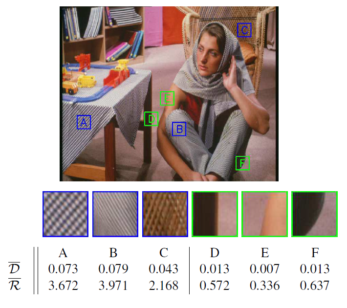

# 本质图像论文笔记

[TOC]

## ICCV2015

### Intrinsic Decomposition of Image Sequences from Local Temporal Variations

作者：Pierre-Yves Laffont，Jean-Charles Bazin，来自苏黎世联邦理工学院。

这篇文章是基于图像序列的本质图像分解，采用基于优化的方法，主要特色是观察随着时间变化局部色彩的变化，通过构造这一约束来解决本质图像分解这个病态的问题，另外，为了保证全局连

续，还使用了一个距离对的像素约束。

假定输入有$T$帧，定义$M$为一帧的像素个数，$I_t$代表第t帧，$t \in\{1, \ldots, T\}$. $I(p, t)^{(c)}$代表第t帧第c个颜色通道的第p个像素，假设场景是静态的和朗伯的(Lambertian), 可以构建如下等式：
$$
I(p, t)^{(c)}=R(p)^{(c)} S(p, t)^{(c)}
$$
其中$R$代表反射率，$S$代表光照，下面可以忽略上标$c$, 因为每个单独通道是独立的，可以单独处理。

**来自时间颜色变化的局部约束**

首先要对$T$帧数据进行滑窗，得到重叠的小块区域，每个小块区域都是正方形，有N个像素，考虑这样的小块区域，可以在局部区域构建平滑能量，在确定条件下，光照在这一个小块区域中，是一个常量。所以上述公式又可以变为：

$$
I(p, t)=R(p) S(i, t)
$$
于是对于每个小块区域，可以构建如下局部能量：
$$
e_{\mathrm{local}}(i, t)=\sum_{p \in \mathcal{W}_{i}}\left(R(p)-\frac{1}{S(i, t)} I(p, t)\right)^{2}
$$
然后不同帧的小块区域可能某些会有阴影分界线以及深度不连续，所以对于这些小块区域，不能完全用平等地对待它们，有两个处理方式，第一个是加入鲁棒的损失函数，将上式变为如下形式：
$$
e_{\text { local }}(i)=\sum_{t} \rho\left(e_{\text { local }}(i, t)\right)
$$
这里的$\rho(x)$是$\sqrt{x}$函数，对于那些有阴影分界线以及深度不连续的区域（外点），它们会构成很大的残差，所以使用平方根函数对残差进行缩小，减小外点的影响，另外一点是使用了迭代重权重最小二乘法对局部能量进行约束，公式如下：
$$
\left(\mathbf{R}_{i}^{(k+1)}, \mathbf{S}_{i}^{(k+1)}\right)=\arg \min _{\mathbf{R}_{i}, \mathbf{S}_{i}} \sum_{t} w_{i t}^{(k)} e_{\mathrm{local}}(i, t)
$$
这里的$e_{\text {local}}(i, t)$是加上上面鲁棒损失函数的，$w_{i t}^{(k)}​$就是对不同帧的局部区域进行加权，方法是自适应的，所以会给那些影响局部能量大的外点更小的权重，减轻它们的影响。

公式5中还是由两个未知量$R$和$S$，然后作者在文中中，区域的光照可以表示为区域反射值得累加并通过一个函数表示，具体说明在支撑材料中，然而并没有找到那个材料。这里给出公式：
$$
\frac{1}{S(i, t)}=\mathbf{I}_{i t}^{\top} \mathbf{R}_{i} /\left(\mathbf{I}_{i t}^{\top} \mathbf{I}_{i t}\right)
$$
这里的$\mathbf{I}_{i t}^{\top}​$是$Nx1​$的列向量，是对第$t​$帧第$i​$个局部区域$W_i​$的像素进行纵向堆叠而成。于是公式4变为了$e_{\text {local}}(i, t)=\left\|\mathbf{M}_{i t} \mathbf{R}_{i}\right\|^{2}​$，其中$\mathbf{M}_{i t}=\mathbf{I} \mathbf{d}_{N}-\left(\mathbf{I}_{i t}^{\top} \mathbf{I}_{i t}\right)^{-1} \mathbf{I}_{i t} \mathbf{I}_{i t}^{\top}​$，$\mathbf{I} \mathrm{d}_{N}​$是一个$NxN​$的单位矩阵。将这个关系带入到公式5中，得到迭代公式如下：
$$
\mathbf{R}_{i}^{(k+1)}=\arg \min _{\mathbf{R}_{i}} \sum_{t} w_{i t}^{(k)}\left\|\mathbf{M}_{i t} \mathbf{R}_{i}\right\|^{2}
$$
上述公式7只有一个未知数$\mathbf{R}_{i}​$，可以通过$SVD​$算法求出最优解$\mathbf{R}_{i}​$对应的与矩阵最小奇异值相关的奇异向量$\mathbf{M}_{i}​$=$\sum_{t} \sqrt{w_{i t}^{(k)}} \mathbf{M}_{i t}​$，最后将所有区域和在的一起的总局部能量$E_{\text {local}}​$为如下公式：
$$
E_{\text { local }}=\frac{1}{|\Gamma|} \sum_{\mathcal{W}_{i} \in \Gamma} e_{\text {local}}(i)=\frac{1}{|\Gamma|} \sum_{\mathcal{W}_{i} \in \Gamma}\left\|\mathbf{M}_{i} \mathbf{R}_{i}\right\|^{2}
$$
**阴影一致性的成对约束**

上述约束是针对于局部能量，然而只使用上面的能量会导致局部与局部之间发生不连续的作用。所以作者提出了一种基于距离的点对点的约束，这个约束是选取相同光照值的两个点进行约束，对于第$t$帧拥有相同光照的两个点$p$和$q$，根据公式1，可以写出如下公式：
$$
R(p) I(q, t)=R(q) I(p, t)
$$
然后类似可以构建如下能量公式：
$$
e_{\text {pair}}(p, q)=\sum_{t}(R(p) I(q, t)-R(q) I(p, t))^{2}
$$
依然，使用迭代重加权最小二乘法，给公式10加上权重项，自适应地分配权重，公式如下：
$$
\begin{array}{l}{\left(R(p)^{(k+1)}, R(q)^{(k+1)}\right)=}  {\quad \underset{R(p), R(q)}{\operatorname{argmin}} \sum_{t} w_{p q t}^{(k)}(R(p) I(q, t)-R(q) I(p, t))^{2}}\end{array}
$$
最后的总距离点对点能量如下：
$$
E_{\mathrm{pair}}=\frac{1}{|\Phi|} \sum_{(p, q) \in \Phi} e_{\mathrm{pair}}(p, q)
$$
上面还没介绍如何选择这样的点对，作者也没有详细介绍，只说了方法，对像素点的外观轮廓进行聚类，在每个聚类中心选择点对集合。

**总的能量约束**

根据上面的两个约束，总的约束为：
$$
\underset{\mathbf{R}}{\operatorname{argmin}} E_{\text {local}}+\gamma_{\text {pair}} E_{\text {pair}} + \gamma_{\mathrm{reg}}E_{\mathrm{reg}}
$$
其中$E_{\mathrm{reg}}$为$\sum_{p} \sum_{t}\left(R(p)-\frac{3 I(p, t)}{\sum_{c} I(p, t)^{(c)}}\right)^{2}​$，是一个正则项，用于倾向于接近输入图像色度的反射率值。

## ICCV2016

### Deep Specialized Network for Illuminant Estimation

作者：WuShi1, [Chen Change Loy](http://personal.ie.cuhk.edu.hk/~ccloy/)1,2, and [Xiaoou](http://www.ie.cuhk.edu.hk/people/xotang.shtml)[ Tang](http://www.ie.cuhk.edu.hk/people/xotang.shtml)1,2  来自中国香港中文大学和中科院。

这篇论文不是本质图像分解问题，但类似，这是一篇光照估计的论文，首先看看这个问题目的是啥，看下图：

左边的图像是受到了光照的影响整体偏绿，需要还原出右边的正常图片，这个问题可以归为如下等式问题：
$$
I_{c}=E_{c} \times R_{c}, \quad c \in\{r, g, b\}
$$
其中$I$为受光照影响形成的偏绿图像，$E$为RGB光照，R为在白光条件下的RGB值（需要还原的图像）。这篇文章设计了两个网络以及一个学习策略（HypNet + winner-take-all learning scheme + SelNet），来对这个问题来进行求解。

先贴出网络结构图：

输入通过了紫外线转换，变成了两个通道，更加鲁棒地学习，最后可以通过反操作得到RGB值。上面这个HypNet网络是用来预测原图的光照信息，输入是原图的一个小块区域，这个网络共享卷积层，但在全连接层分出了两个分支，预测了两个光照输出，下面这个SelNet网络跟上面网络结构类似，不过只有一个分支，输出是一个2维列向量，标签由上面这个网络得到。

**如何训练？**

HypNet网络预测两个光照输出，哪个分支产生的输出与真实的标签更接近，就更新哪个分支的全连接层，另外一个分支的全连接层固定不动，这是策略作者取了一个很好听的名字，叫做`赢者通吃策略`， 对于那个更接近真实标签的输出，设立它所在的分支为1，另一个分支为0，这个将作为下面SelNet网络的标签，使SelNet进行训练。

**如何测试？**

测试的时候也是通过小块区域，通过SelNet网络选出采用哪个分支的结果，然后根据结果恢复出当前区域，最后整合所有恢复的小块区域得到原图。

思想还是挺有趣的，PypNet相当于是一个集成网络，不同分支学习到了不同的特征，见下图，可以预测多种类型的输出。而下面的SelNet则是自动筛选最优的估计。感觉很完整优美。

## ICCV2017

###  A Joint Intrinsic-Extrinsic Prior Model for Retinex

这篇文章的主要特点在于首次将形状先验带入到Retinex中，提出了Local Variation deviation（LVD）的概念，通过将LVD作为形状先验来保护结构的完整性。然后联合纹理先验，光照先验以及重建损失构成最终的优化函数，求解最优解，与之前的retinex方法相比，达到了SOTA。（论文中S代表观测图像，I代表Illumination，R代表Reflectance）

LVD可以分成两个部分来看，第一个部分是LV，即局部变化，代表的是梯度特征，然后第二部分是D，即偏差，指的是梯度的偏差。LVD可以看作是对局域梯度进行一种规范化，去除均值的影响，得到梯度变化的方差相关性，纹理是趋向于弱相关性的，而结构是趋向于强相关性的，LVD则正好对纹理和结构有非常强的鉴别能力。LVD的公式如下所示，这里的没有使用减去均值的绝对偏差，而采用的是相对偏差，相对偏差更能放大相关性差异。从下图中人物中纹理（蓝色方框）与结构（绿色方框）的在绝对偏差和相对偏差中数值可以看出，纹理和结构确实在LVD中有明显差别，而且使用相对偏差能够放大差异。

$$
\mathcal{D}_{x / y}=\left|\nabla_{x / y} I-\frac{1}{|\Omega|} \sum_{\Omega} \nabla_{x / y} I\right| ---> \mathcal{R}_{x / y}=\left|\frac{\nabla_{x / y} I}{\frac{1}{|\Omega|} \sum_{\Omega} \nabla_{x / y} I+\epsilon}\right|
$$
另外，文章还给出了纹理先验以及光照先验，纹理先验是保持反射图间断连续，则纹理先验可以形成如下公式：
$$
E_{t}(R)=\left\|\nabla_{x} R\right\|_{1}+\left\|\nabla_{y} R\right\|_{1}
$$
作者对$S=I \cdot R$进行反转，变换成了$(1-S)=1-I \cdot R=(1-R) \cdot I+(1-I)$, 通过让$\mathrm{H}=1-\mathrm{S}, \mathrm{J}=1-\mathrm{R}, \mathrm{T}=\mathrm{I}$以及$a=1$，原始变换成了$\mathrm{H}=\mathrm{J} \cdot \mathrm{T}+\mathrm{a}(1-\mathrm{T})$，最后公式类似雾霾图像的形成模型，H代表有雾霾的观测图像，J是需要还原出的图像，T是媒介传播，a是全球大气光，作者引用了何凯明等人提出的去雾算法的暗通道先验，暗通道先验公式如下所示，更具体地推导可以看[原始论文](http://mmlab.ie.cuhk.edu.hk/archive/2011/Haze.pdf)
$$
T=1-\min _{\Omega}\left(\min _{c \in\{r, g, b\}} \frac{H^{c}}{a}\right)
$$
暗通道先验是说在绝大多数非天空的局部区域内，某一些像素至少一个颜色通道具有很低的值，这是何凯明等人基于5000多张自然图像的统计得到的定理。作者根据公式推导出了亮通道先验，公式如下：
$$
I=1-\min _{\Omega}\left(\min _{c \in\{r, g, b\}}(1-S)^{c}\right)=\max _{\Omega}\left(\max _{c \in\{r, g, b\}} S^{c}\right)
$$
然后令$\mathrm{B}=\max _{\Omega}\left(\max _{c} S^{c}\right)$，最后使用L2距离损失最小化估计光照和亮通道先验。
$$
E_{l}(I)=\|I-B\|_{2}^{2}
$$
联合优化的最后公式如下：
$$
E(I, R)=\|I \cdot R-S\|_{2}^{2}+\alpha E_{s}(I)+\beta E_{t}(R)+\lambda E_{l}(I)
$$
然后由于$E_{s}(I)$以及$E_{t}(I)$都是L1范数，非凸，所以作者这两个先验进行了改进，变成了L2范数，公式如下：
$$
\left\{\begin{array}{c}{E_{s}(I)=u_{x}\left\|\nabla_{x} I\right\|_{2}^{2}+u_{y}\left\|\nabla_{y} I\right\|_{2}^{2}} \\ {E_{t}(R)=v_{x}\left\|\nabla_{x} R\right\|_{2}^{2}+v_{y}\left\|\nabla_{y} R\right\|_{2}^{2}}\end{array}\right.
$$

$$
\left\{\begin{array}{l}{u_{x / y}=\left(\left|\frac{1}{\Omega} \sum_{\Omega} \nabla_{x / y} I\right|\left|\nabla_{x / y} I\right|+\epsilon\right)^{-1}} \\ {v_{x / y}=\left(\left|\nabla_{x / y} R\right|+\epsilon\right)^{-1}}\end{array}\right.
$$

项目主页：<https://caibolun.github.io/JieP/>

代码: <https://github.com/caibolun/JieP>

## CVPR2018

### SfSNet: Learning Shape, Reflectance and Illuminance of Faces `in the Wild'

之前相关人脸本质图像分解的工作都是在合成数据集中完成的， 但到真实的人脸，不同分布使得泛化效果很差，这篇论文的特色是提出了一种新的训练范式（SFS-supervision），从真实无标签的真实人脸数据中学习形状，反射以及光照，并且还提出了一种更强大的网络模型（SFS-Net）。

**SFS-supervision**分为以下三步：

a)  先使用3DMM中合成的数据集训练SFS-Net；

b)  然后用训练好的网络对真实的人脸数据集生成伪标签；

c)  最后共同训练合成数据集以及带有伪标签的真实数据集。

直接对真实图像使用重建损失进行反向传播会使分解过程中各个组件发生崩溃而产生平凡解，这里的伪标签是很大程度上缓解这种情况的产生。

**SFS-Net****网络**结构如下：

网络并没有采用传统的U-Net结构，作者指出了U-Net的缺点，由于高频特征可以直接通过远跳跃连接从编码器传到解码器，所以对于胡须以及皱纹这种高频特征是不知道它来自于Normal还是Albedo的，潜在空间所具有的信息性弱，所以作者提出了SFS-Net，通过一个共享Conv，然后分两路通过Normal Residual Blocks和Albedo Residual Blocks（残差块可以进行低频与高频的共同学习），得到Normal features和Albedo features，最后Normal features和Albedo features分别通过各自的Conv得到形状图以及反射图，生成光照信息则是将image features，Normal features和Albedo features三者进行concat，然后通过一个Light Estimator得到SH light，最后形状图和光照信息联合通过一个函数得到光照图，光照图和反射图相乘重建出原图。网络有四个LOSS，除了SH light是L2 loss，Normal，Albedo以及Recon都是L1 loss。网络更多细节参考[**论文附录**](https://arxiv.org/pdf/1712.01261v1)以及[**代码**](https://github.com/senguptaumd/SfSNet)。

## ECCV2018

###  Single Image Intrinsic Decomposition without a Single Intrinsic Image

本质图像分解按照图片的数量可以分为single-image based和multi-image based，基于单张图片的方法的缺点在于缺少标签，而基于多张图片的算法虽然不需要标签，但由于需要多张图像，这在现实情况下很难应用。

本文提出了一种全新的思路，通过多张图片进行无GT训练，但在测试过程中使用单张图片进行预测，还可以联合带标签的数据进一步提升分解效果，实验表明当使用50%的标签图像时就可以达到SOTA。网络结构图如下：

将不同光照条件的同一物体的两个图像通过一个共享参数的孪生网络（用的常规U-Net），得到两个图像的反射图，光照图以及软分配掩模，首先$I_1$通过孪生网络得到反射图$A_1$以及光照图$S_1$, 反射图$A_1$和光照图$S_1$可以相乘重建原图$I_1$，$I_2$通过孪生网络同样得到反射图$A_2$以及光照图$S_2$，由于反射图是光照不变性的，所以$A_2$和$S_1$同样可以重建原图$I_1$，两个重建可以与$I_1$构成两个**重建L1_loss**, 软分配掩模是预测图片在每点像素值的梯度是属于反射图的概率，所以$I_2$的梯度与软分配掩模$M_2$相乘代表的是反射图$A_2$的梯度，与预测的$A_2$的梯度进行**梯度L1_loss**，反射图和光照图的概率和为1，通过1减去软分配掩模$M_2$的概率即使光照图的梯度概率，剩下的操作与反射图一样。另外，反射图可能会出现全白像素的图像，这种图像也是光照不变性的，为了防止这种退化情况的产生，作者加了一个额外的**embedding loss $L_{1}^{e b d}$**用来正则化，让两个反射图尽可能一样，同时随机采样要保持两个反射图有差异。

### Joint Learning of Intrinsic Images and Semantic Segmentation

这篇论文是本质图像分解与语义分割的结合，本质图像去除了光照的影响，会促进语义分割的准确度，而语义分割的标签给图像分块，使得图像具有像素块的颜色信息，边界导向的信息，同质反射值相同信息等等，所以语义分割应该也会促进本质图像分解的性能。

由于缺少既有本质图像以及语义分割的数据集，所以作者自己做了一个，场景级下的自然环境合成数据集，含有本质图像GT以及语义分割GT。另外，作者提出了一个新的层级CNN架构用来联合训练本质图像分解以及语义分割，最后用实验分析了两种问题联合训练所带来的好处。

CNN层级架构如下：

网络结构与U-Net有些不同，一个是多一个生成语义分割图的decoder，另外光照图的decoder和反射图以及语义分割的decoder进行了互相层间级联concat，这种网络有一点比较有特色，通过这样级联以及共用一个编码器，可以是本质图像分解以及语义分割互相影响，相互监督并促进性能提升。作者做了多个实验验证了两个任务的确有促进作用，联合训练效果更佳。

损失函数如下图，反射图和光照图使用的MSE以及带尺度的MSE，语义分割图用的则是交叉熵损失函数，$p_{x}^{L}$代表给定像素x属于类别L的概率。
$$
\mathcal{L}_{M S E}(J, \hat{J})=\frac{1}{n} \sum_{\boldsymbol{x}, c}\|\hat{J}-J\|_{2}^{2}
$$

$$
\mathcal{L}_{S M S E}(J, \hat{J})=\mathcal{L}_{M S E}(\alpha J, \hat{J})
$$

$$
\mathcal{L}_{C L}(J, \hat{J})=\gamma_{S M S E} \mathcal{L}_{S M S E}(J, \hat{J})+\gamma_{M S E} \mathcal{L}_{M S E}(J, \hat{J})
$$

$$
\mathcal{L}_{I L}(R, \hat{R}, S, \hat{S})=\gamma_{R} \mathcal{L}_{C L}(R, \hat{R})+\gamma_{S} \mathcal{L}_{C L}(S, \hat{S})
$$

$$
\mathcal{L}_{C E}=-\frac{1}{n} \sum_{x} \sum_{L \in O_{x}} \log \left(p_{x}^{L}\right)
$$

$$
\mathcal{L}_{J L}(I, R, \hat{R}, S, \hat{S})=\gamma_{C E} \mathcal{L}_{C E}+\gamma_{I L} \mathcal{L}_{I L}(R, \hat{R}, S, \hat{S})
$$

项目主页：<https://ivi.fnwi.uva.nl/cv/intrinseg>（数据集和模型还未公开）

### CGIntrinsics: Better Intrinsic Image Decomposition through Physically-Based Rendering

这篇论文分析现有本质图像数据集存在的一些问题，如合成数据集受限于单个物体（shapeNet），不真实的光照（CG Animation），缺少细节以及低信噪比（SUNCG），而真实本质图像数据集是稀疏的（IIW和SAW），并且难以收集富集标签，作者在这篇论文中提出了一个**高质量，高信噪比，真实的，仔细渲染的合成数据集CGI**（基于SUNCG，拥有大于20000张图片并带有GT）。另外，作者用半监督学习方式来联合训练带标签的CGI以及无标签的IIW和SAW，最后在IIW以及SAW两种数据集下达到了SOTA。使用的网络还是基本的U-Net，如下图。

损失函数如下图，详细公式可以参考原论文。
$$
\mathcal{L}=\mathcal{L}_{\mathrm{CGl}}+\lambda_{\mathrm{IM}} \mathrm{L}_{\mathrm{IIW}}+\lambda_{\mathrm{SAW}} \mathcal{L}_{\mathrm{SAW}}
$$

$$
\mathcal{L}_{\mathrm{CGl}}=\mathcal{L}_{\mathrm{sup}}+\lambda_{\mathrm{ord}} \mathcal{L}_{\mathrm{ord}}+\lambda_{\mathrm{rec}} \mathcal{L}_{\mathrm{reconstruct}}
$$

$$
\mathcal{L}_{\mathrm{IIW}}=\lambda_{\mathrm{ord}} \mathcal{L}_{\mathrm{ord}}+\lambda_{\mathrm{rs}} \mathcal{L}_{\mathrm{rsmooth}}+\lambda_{\mathrm{ss}} \mathcal{L}_{\mathrm{ssmooth}}+\mathcal{L}_{\mathrm{reconstruct}}
$$

$$
\mathcal{L}_{\mathrm{SAW}}=\lambda_{\mathrm{S} / \mathrm{NS}} \mathcal{L}_{\mathrm{S} / \mathrm{NS}}+\lambda_{\mathrm{rs}} \mathcal{L}_{\mathrm{rsmooth}}+\lambda_{\mathrm{ss}} \mathcal{L}_{\mathrm{ssmooth}}+\mathcal{L}_{\mathrm{reconstruct}}
$$

相关资源：[**项目主页**](http://www.cs.cornell.edu/projects/cgintrinsics/)和[**代码**](https://github.com/lixx2938/CGIntrinsics)

## BMVC2018

### Deep Retinex Decomposition for Low-Light Enhancement

这篇论文是将本质图像分解应用在低光照增强上面的。作者收集了一个包含低/正常光图像对的低光数据集(LOL)，并提出了一个在该数据集上学习到的深层Retinex网络，包括用于分解的Decom-Net和用于照明调节的Enhance-Net。在Decom-Net的训练过程中，没有分解反射率和光照的地面真实值。Decom-Net只在关键约束条件下学习，包括匹配的低/常光图像共享的一致反射率和光照的平滑度。在分解的基础上，利用Enhance-Net增强光照进行后续亮度增强，联合去噪时对反射率进行去噪操作。模型结构如下：

两个输入分别为input_high和input_low，input_high在Decom-Net的输出是R_high和I_high，input_low在Decom-Net的输出是 R_low和I_low, Enhance-Net的输出是I_delta。

Decom-Net loss: 

- 四种重构损失，分别是R_high和I_high合成input_high，R_low和I_low合成input_low，R_low和I_high合成input_high，R_high和I_low合成input_low.
- 反射图一致性：R_low和R_high构成的1范数损失。
- 光照平滑约束：$\mathcal{L}_{i s}=\sum_{i=l o w, n o r m a l}\left\|\nabla I_{i} \circ \exp \left(-\lambda_{g} \nabla R_{i}\right)\right\|$，通过$\exp \left(-\lambda_{g} \nabla R_{i}\right)$的权重的作用，$\mathcal{L}_{i s}$在反射率梯度较大的情况下，即图像结构位置和光照不连续的情况下，放宽了平滑度的约束。分别是R_low和I_low以及R_high和I_high构成的两个约束

Enhance-Net loss:

- 重构损失: I_delta和R_low合成input_high
- 光照平滑约束：I_delta和R_low构成的平滑约束。

项目主页: https://daooshee.github.io/BMVC2018website/