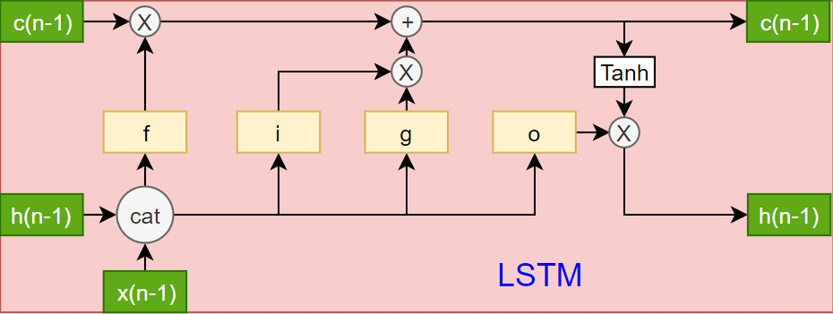

# 本质图像论文笔记

[TOC]

## PAMI2015

### Shape, Illumination, and Reflectance from Shading

作者：[Jonathan T. Barron](<https://jonbarron.info/>) ， Jitendra Malik

对于一幅图像而言，要推断出图像的场景属性（shape, reflectance, illumination），也可以说是本质图像，是一件非常困难的事，因为有无数的形状、颜料和灯光可以精确地再现一幅图像。为了恢复出场景属性，需要对场景属性进行约束（也就是先验），作者基于在自然图像中出现的统计规律（这些规律是因为生成这些图像的底层世界的统计规律）对场景属性构建多种先验，对本质图像分解问题进行建模，进行统计推断， 得到最有可能的解释。

**主要贡献**：

- 将统计规则从自然图像中扩展到产生自然图像的世界；

- 第一个使用这些统计观测来同时恢复所有场景本质属性；

- 提出了SIRFS算法（可以看作是intrinsic image算法，不过shading是shape和Illumination的组合函数形成的，还可以被看作SFS但reflectance和illumination是未知的），首次完整的本质图像分解（将原图分解为reflectance，shape，Illumination）

许多这些本质图像算法的限制因素似乎是它们将shading视为一种图像，忽略了这样一个事实，即shading从结构上来说是某种形状和某种照明模型的产物。通过解决这个本质图像问题的超集，恢复shape和Illumination而不是shading，我们的模型产生了比任何本质图像方法更好的结果。

**SIRFS问题公式化**：
$$
\begin{array}{ll}{\underset{R, Z, L}{\operatorname{maximize}}} & {P(R) P(Z) P(L)} \\ {\text { subject to }} & {I=R+S(Z, L)}\end{array}
$$
其中$R$为log-reflectance image，$Z$为depth-map，$L$为球面谐波Illumination向量。$S(Z, L)$是一个渲染引擎，它的作用是将$Z$线性化一组表面法线，然后通过这些表面法线和L构成log-shading，$P(R), P(Z), P(L)$分别是reflectance, shape和illumination的先验，SIRFS算法就是要在重构约束下，最大化三个先验的似然概率。

进一步化简，将最大化问题转化成最小化问题，取负对数，然后根据重构约束，可以将最大化似然概率转为如下公式，去除了R这个自由未知量。
$$
\underset{Z, L}{\operatorname{minimize}} \quad g(I-S(Z, L))+f(Z)+h(L)
$$
**反射先验**

三种先验：Smoothness，Parsimony，Absolute Reflectance。

**Smoothness**：自然图像的反射图趋向于分段连续，这等效于反射图的变化趋向小而稀疏，作者在灰度反射平滑使用一个多元高斯尺度混合(GSM)，将每个反射率像素与其相邻像素之间的差值叠加在一起，在这个模型下使R的可能性最大化，它对应于最小化下面的cost函数：
$$
g_{s}(R)=\sum_{i} \sum_{j \in N(i)} c\left(R_{i}-R_{j} ; \boldsymbol{\alpha}_{R}, \boldsymbol{\sigma}_{R}\right)
$$
其中$R_i - R_j$为从像素$i$到像素$j$的$log-RGB$的差异, $N(i)$是围绕i领域为5的区域，$c(\cdot ; \alpha, \sigma)$为离散单变量的负对数似然混合高斯尺度，$\alpha$和$\sigma$为参数，公式如下：
$$
c(x ; \boldsymbol{\alpha}, \boldsymbol{\sigma})=-\log \sum_{j=1}^{M} \alpha_{j} \mathcal{N}\left(x ; 0, \sigma_{j}^{2}\right)
$$
反射率图像最可能是平的，所以设定GSM的均值为0. 

高斯尺度混合模型以前曾被用于模拟自然图像中的重尾分布，用于去噪或图像修复。同样地，使用这个分布族给我们一个对数似然，它看起来像一个光滑的，重尾样条曲线，从0开始单调地递减。*反射率变化的代价随变化幅度的增大而增大，但由于分布具有较重的尾部，小变化的影响是最强烈的（对应于shading的变化），大变化的影响是最微弱的。这与希望反射图大部分是平的，但偶尔变化很大吻合。*（这句话不太懂）


**Parsimony**

对反射率图像的期望是，在一张图像中有少量反射率，即用于绘制图像的调色板是小的。作者展示了数据集中三个对象的灰度对数反射率的边缘分布。虽然人造的cup1物体在其分布上表现出最明显的峰顶，但像apple这样的自然物体却表现出明显的集群性。因此，我们将构建一个鼓励节俭的先验——即我们对场景反射率的表示是经济和有效的，或“稀疏的”。


只使用一个平滑的先验，如在a，允许反射率变化在不连通区域。在b中，只使用节俭的先验，鼓励反射率取少量的值，但不鼓励它形成大的分段常数区域。只有把这两个先验结合起来使用，如c我们的模型是否正确地支持正常的、类似于油漆的棋盘配置。这证明了我们对反射率的光滑性和节俭先验的重要性。


利用二次熵公式，使对数反射率的熵最小，从而鼓励节俭，公式如下：
$$
\begin{aligned} g_{e}(R) &=-\log \left(\frac{1}{Z} \sum_{i=1}^{N} \sum_{j=1}^{N} \exp \left(-\frac{\left(R_{i}-R_{j}\right)^{2}}{4 \sigma_{R}^{2}}\right)\right) \\ Z &=N^{2} \sqrt{4 \pi \sigma^{2}} \end{aligned}
$$
**Absolute Reflectance**

没有绝对先验，我们的模型将乐于将图像中的灰色像素解释为在灰色照明下的灰色反射，或者像在极亮照明下的近似黑色反射，或者在黄色照明下的蓝色反射，等等。

绝对先验对于颜色恒常性是基本的，因为大多数基本的白平衡或自动对比度/亮度算法都可以被看作是将类似的成本最小化：灰色世界假设对非灰色的反射率进行惩罚，白色世界假设对非白色的反射率进行惩罚，基于色差的模型对位于以前可见反射率范围之外的反射率进行惩罚。

先验公式：
$$
\underset{\mathbf{f}}{\operatorname{minimize}} \quad \mathbf{f}^{\mathrm{T}} \mathbf{n}+\log \left(\sum_{i} \exp \left(-\mathbf{f}_{i}\right)\right)+\lambda \sqrt{\left(\mathbf{f}^{\prime \prime}\right)^{2}+\epsilon^{2}}
$$
$f$是我们的样条曲线，它决定了分配给每个反射率的非标准化负对数似然，$n$为对数反射率的一维直方图，$\mathbf{f}^{\prime \prime}$是样条函数的二阶偏导，$\epsilon$确保先验公式可微。

**形状先验**

三种先验：Smoothness，Surface Isotropy，The Occluding Contour。

**Smoothness**

平滑度的假设是基于形状很少弯曲，通过最小化平均曲率的变化来建立模型。


上面图形是形状及其平均曲率的可视化(蓝色=正，红色=负，白色= 0)。平面和肥皂膜的平均曲率为0，球体和圆柱体的平均曲率为常数，形状弯曲时平均曲率变化。

平均曲率的计算公式如下：
$$
H(Z)=\frac{\left(1+Z_{x}^{2}\right) Z_{y y}-2 Z_{x} Z_{y} Z_{x y}+\left(1+Z_{y}^{2}\right) Z_{x x}}{2\left(1+Z_{x}^{2}+Z_{y}^{2}\right)^{3 / 2}}
$$
对形状的平滑先验是一个高斯尺度的混合对Z的平均曲率的局部变化：
$$
f_{k}(Z)=\sum_{i} \sum_{j \in N(i)} c\left(H(Z)_{i}-H(Z)_{j} ; \boldsymbol{\alpha}_{k}, \boldsymbol{\sigma}_{k}\right)
$$
公式与反射图的平滑先验一致。

**Surface Isotropy**

我们假设形状的表面是各向同性的——同样可能面向任何方向，比如在球体中。然而，观察各向同性形状会产生偏差，因为观察到的表面更可能面向观察者，而不是垂直于观察者(如下图a中放置在球体上的红色标尺图形图钉所示)。我们通过在$N^z$上施加先验来消除这种偏差，如下图b所示，它粗略地类似于我们的训练数据


表面各向同性先验的公式如下：
$$
f_{i}(Z)=-\sum_{x, y} \log \left(N_{x, y}^{z}(Z)\right)
$$
$N_{x, y}^{z}(Z)$是Z的表面法线在位置$(x,y)$上的$z$分量.

**The Occluding Contour**

形状的遮挡轮廓(包围形状轮廓的轮廓)是一种强大的形状解释线索，它通常控制shading线索，并提出了算法来粗略估计给定轮廓信息的形状.

在物体的遮挡轮廓上，表面与所有有利位置的光线相切。在正交投影下(我们假设)，这意味着法线的z分量为0,x和y分量由图像中的轮廓决定。表面的闭合轮廓往往由分支(表面从有利位置与光线相切的点，如圆柱体的光滑面)和边缘(表面的突然不连续，如圆柱体的顶部或一张纸的边缘)组成.

我们提出了分支先验的“软”版本，它捕捉了我们期望看到的类似“分支”的行为，但是它可能被边缘或小分支违反。
$$
f_{c}(Z)=\sum_{i \in C}\left(1-\left(N_{i}^{x}(Z) n_{i}^{x}+N_{i}^{y}(Z) n_{i}^{y}\right)\right)^{\gamma_{c}}
$$
该杯的侧面是“分支”，即表面法线面向外并垂直于闭合轮廓的点，而杯的顶部是“边缘”，即表面任意定向的尖锐间断。


**光照先验**

因为光照是未知的，必须在推理过程中对其进行正则化。对光照的先验是:在训练集中对球面谐波光照进行多元高斯拟合。在推断过程中，我们强加的cost是该模型下的(非标准化)负对数似然：
$$
h(L)=\lambda_{L}\left(L-\boldsymbol{\mu}_{L}\right)^{\mathrm{T}} \Sigma_{L}^{-1}\left(L-\boldsymbol{\mu}_{L}\right)
$$
以上就是所有的先验，这篇文章难度好大，没有理解，先到这吧。

## ICCV2015

### Intrinsic Decomposition of Image Sequences from Local Temporal Variations

作者：Pierre-Yves Laffont，Jean-Charles Bazin，来自苏黎世联邦理工学院。

这篇文章是基于图像序列的本质图像分解，采用基于优化的方法，主要特色是观察随着时间变化局部色彩的变化，通过构造这一约束来解决本质图像分解这个病态的问题，另外，为了保证全局连

续，还使用了一个距离对的像素约束。

假定输入有$T$帧，定义$M$为一帧的像素个数，$I_t$代表第t帧，$t \in\{1, \ldots, T\}$. $I(p, t)^{(c)}$代表第t帧第c个颜色通道的第p个像素，假设场景是静态的和朗伯的(Lambertian), 可以构建如下等式：
$$
I(p, t)^{(c)}=R(p)^{(c)} S(p, t)^{(c)}
$$
其中$R$代表反射率，$S$代表光照，下面可以忽略上标$c$, 因为每个单独通道是独立的，可以单独处理。

**来自时间颜色变化的局部约束**

首先要对$T$帧数据进行滑窗，得到重叠的小块区域，每个小块区域都是正方形，有N个像素，考虑这样的小块区域，可以在局部区域构建平滑能量，在确定条件下，光照在这一个小块区域中，是一个常量。所以上述公式又可以变为：

$$
I(p, t)=R(p) S(i, t)
$$
于是对于每个小块区域，可以构建如下局部能量：
$$
e_{\mathrm{local}}(i, t)=\sum_{p \in \mathcal{W}_{i}}\left(R(p)-\frac{1}{S(i, t)} I(p, t)\right)^{2}
$$
然后不同帧的小块区域可能某些会有阴影分界线以及深度不连续，所以对于这些小块区域，不能完全用平等地对待它们，有两个处理方式，第一个是加入鲁棒的损失函数，将上式变为如下形式：
$$
e_{\text { local }}(i)=\sum_{t} \rho\left(e_{\text { local }}(i, t)\right)
$$
这里的$\rho(x)$是$\sqrt{x}$函数，对于那些有阴影分界线以及深度不连续的区域（外点），它们会构成很大的残差，所以使用平方根函数对残差进行缩小，减小外点的影响，另外一点是使用了迭代重权重最小二乘法对局部能量进行约束，公式如下：
$$
\left(\mathbf{R}_{i}^{(k+1)}, \mathbf{S}_{i}^{(k+1)}\right)=\arg \min _{\mathbf{R}_{i}, \mathbf{S}_{i}} \sum_{t} w_{i t}^{(k)} e_{\mathrm{local}}(i, t)
$$
这里的$e_{\text {local}}(i, t)$是加上上面鲁棒损失函数的，$w_{i t}^{(k)}$就是对不同帧的局部区域进行加权，方法是自适应的，所以会给那些影响局部能量大的外点更小的权重，减轻它们的影响。

公式5中还是由两个未知量$R$和$S$，然后作者在文中中，区域的光照可以表示为区域反射值得累加并通过一个函数表示，具体说明在支撑材料中，然而并没有找到那个材料。这里给出公式：
$$
\frac{1}{S(i, t)}=\mathbf{I}_{i t}^{\top} \mathbf{R}_{i} /\left(\mathbf{I}_{i t}^{\top} \mathbf{I}_{i t}\right)
$$
这里的$\mathbf{I}_{i t}^{\top}$是$Nx1$的列向量，是对第$t$帧第$i$个局部区域$W_i$的像素进行纵向堆叠而成。于是公式4变为了$e_{\text {local}}(i, t)=\left\|\mathbf{M}_{i t} \mathbf{R}_{i}\right\|^{2}$，其中$\mathbf{M}_{i t}=\mathbf{I} \mathbf{d}_{N}-\left(\mathbf{I}_{i t}^{\top} \mathbf{I}_{i t}\right)^{-1} \mathbf{I}_{i t} \mathbf{I}_{i t}^{\top}$，$\mathbf{I} \mathrm{d}_{N}$是一个$NxN$的单位矩阵。将这个关系带入到公式5中，得到迭代公式如下：
$$
\mathbf{R}_{i}^{(k+1)}=\arg \min _{\mathbf{R}_{i}} \sum_{t} w_{i t}^{(k)}\left\|\mathbf{M}_{i t} \mathbf{R}_{i}\right\|^{2}
$$
上述公式7只有一个未知数$\mathbf{R}_{i}$，可以通过$SVD$算法求出最优解$\mathbf{R}_{i}$对应的与矩阵最小奇异值相关的奇异向量$\mathbf{M}_{i}$=$\sum_{t} \sqrt{w_{i t}^{(k)}} \mathbf{M}_{i t}$，最后将所有区域和在的一起的总局部能量$E_{\text {local}}$为如下公式：
$$
E_{\text { local }}=\frac{1}{|\Gamma|} \sum_{\mathcal{W}_{i} \in \Gamma} e_{\text {local}}(i)=\frac{1}{|\Gamma|} \sum_{\mathcal{W}_{i} \in \Gamma}\left\|\mathbf{M}_{i} \mathbf{R}_{i}\right\|^{2}
$$
**阴影一致性的成对约束**

上述约束是针对于局部能量，然而只使用上面的能量会导致局部与局部之间发生不连续的作用。所以作者提出了一种基于距离的点对点的约束，这个约束是选取相同光照值的两个点进行约束，对于第$t$帧拥有相同光照的两个点$p$和$q$，根据公式1，可以写出如下公式：
$$
R(p) I(q, t)=R(q) I(p, t)
$$
然后类似可以构建如下能量公式：
$$
e_{\text {pair}}(p, q)=\sum_{t}(R(p) I(q, t)-R(q) I(p, t))^{2}
$$
依然，使用迭代重加权最小二乘法，给公式10加上权重项，自适应地分配权重，公式如下：
$$
\begin{array}{l}{\left(R(p)^{(k+1)}, R(q)^{(k+1)}\right)=}  {\quad \underset{R(p), R(q)}{\operatorname{argmin}} \sum_{t} w_{p q t}^{(k)}(R(p) I(q, t)-R(q) I(p, t))^{2}}\end{array}
$$
最后的总距离点对点能量如下：
$$
E_{\mathrm{pair}}=\frac{1}{|\Phi|} \sum_{(p, q) \in \Phi} e_{\mathrm{pair}}(p, q)
$$
上面还没介绍如何选择这样的点对，作者也没有详细介绍，只说了方法，对像素点的外观轮廓进行聚类，在每个聚类中心选择点对集合。

**总的能量约束**

根据上面的两个约束，总的约束为：
$$
\underset{\mathbf{R}}{\operatorname{argmin}} E_{\text {local}}+\gamma_{\text {pair}} E_{\text {pair}} + \gamma_{\mathrm{reg}}E_{\mathrm{reg}}
$$
其中$E_{\mathrm{reg}}$为$\sum_{p} \sum_{t}\left(R(p)-\frac{3 I(p, t)}{\sum_{c} I(p, t)^{(c)}}\right)^{2}$，是一个正则项，用于倾向于接近输入图像色度的反射率值。

## PAMI2016

### Intrinsic Scene Properties from a Single RGB-D Image

作者：[Jonathan T. Barron](<https://jonbarron.info/>) ， Jitendra Malik

之间介绍了一篇“Shape, Illumination, and Reflectance from Shading”，也就是SIRFS算法，这篇论文是SIRFS算法的延申，SIRFS假设输入图像是单个对象的分割图像，在单个全局光照模型下进行光照，这严重限制了其性能。相反，自然图像包含许多形状，这些形状可能相互遮挡或相互支持，以及以阴影、衰减和相互反射的形式出现的复杂的、空间变化的照明。作者在这篇文章中提出了Scene-SIRFS算法（extends SIRFS from objects to scenes），将混合的形状和混合的光照嵌入到输入图像的“软”分割中，另外通过kinect提供的有噪声的深度图提升形状估计，给定单个RGB-D图像推断出所有的场景属性。

**原始的SIRFS**：
$$
\begin{array}{ll}{\underset{R, Z, L}{\operatorname{minimize}}} & {g(R)+f(Z)+h(L)} \\ {\text { subject to }} & {I=R+S(Z, L)}\end{array}
$$
其中$R$为log-reflectance image，$Z$为depth-map，$L$为27维的球面谐波Illumination向量。$S(Z, L)$是一个渲染引擎，它的作用是将$Z$线性化一组表面法线，然后通过这些表面法线和L构成log-shading，$g(R), f(Z)$ 和 $h(L)$分别为反射，形状，光照的损失函数。

**Scene-SIRFS**：
$$
\begin{array}{l}\underset{R, Z, \psi, L, \omega}{\operatorname{minimize}} \space g(R)+\sum_{n=1}^{|Z|} f^{\prime}\left(Z^{n}, U^{n}\right)+h^{\prime}\left(\sum_{m=1}^{|L|} V^{m} L^{m}\right) \\ {\text { subject to } \quad I=R+S^{\prime}(Z, U, L, V)} \\ {U^{n}=\frac{\exp \left(B \psi^{n}\right)}{\sum_{n^{\prime}} \exp \left(B \psi^{n^{\prime}}\right)}, \forall_{n}} \\ {V^{m}=\frac{\exp \left(B \psi^{n}\right)}{\sum_{m^{\prime}} \exp \left(B \omega^{m^{\prime}}\right)}, \forall_{m}}\end{array}
$$
其中$Z=\left\{Z^{n}\right\}, \boldsymbol{U}=\left\{U^{n}\right\}, \boldsymbol{L}=\left\{L^{m}\right\}，\boldsymbol{V}=\left\{V^{m}\right\}$, 这里的$Z$和$L$是形状和光照的集合，而原始的SIRFS是单个形状和单个光照，另外这里还多了两个东西，一个是$U$，一个是$V$，$U$和$V$可以看作两组“图像”，分别定义形状和光照的分布。$U$可以看作为可见性地图，如果$U_{i, j}^{n}$等于1，那么对应的$Z_{i, j}^{n}$在像素点(i, j)中就是可见的。$V$可以看作$L$中每个照明的所有权，如果$V_{i, j}^{m}$等于1，那么则代表像素点(i, j)被$L^m$完全照明。在形状上的先验现在是每个正规化独立的单深度图先验的求和。在光照上的先验现在是图像的每个像素的光照加权求和。形状混合概率$U$和光照混合概率$V$是分别被矩阵$\boldsymbol{\psi}$和$\boldsymbol{\omega}$权重化，矩阵的每一列是一个17维的向量，代表场景中形状混合和光照混合的所有权。$U$和$V$分别由它的权重矩阵以及B（RGB图像的归一化拉普拉斯特征向量）点乘，然后通过一个softmax函数得出。实验设立$|L| = |Z| = 8$.


为了能进行优化，还需要定义这个混合形状的法线场$N^{\prime}(Z, \boldsymbol{U})$，将把每个$Z^n$线性化为x和y中的一组偏导数，取那些对U的期望，然后从那些期望的偏导数中构造一个正规场，公式如下：
$$
\begin{array}{c}{N^{\prime}(Z, \boldsymbol{U})=\left\{\frac{D^{x}}{D^{m}}, \frac{D^{y}}{D^{m}}, \frac{1}{D^{m}}\right\}} \\ {D^{x}=\sum_{n=1}^{|Z|} U^{n}\left(Z^{n} * h^{x}\right), \quad D^{y}=\sum_{n=1}^{|\boldsymbol{Z}|} U^{n}\left(Z^{n} * h^{y}\right)} \\ {D^{m}=\sqrt{1+\left(D^{x}\right)^{2}+\left(D^{y}\right)^{2}}} \\ {h^{x}=\frac{1}{8} \left[ \begin{array}{ccc}{1} & {0} & {-2} \\ {2} & {0} & {-2} \\ {1} & {0} & {-1}\end{array}\right], \quad h^{y}=\frac{1}{8} \left[ \begin{array}{ccc}{1} & {2} & {0} \\ {0} & {0} & {0} \\ {1} & {0} & {-1}\end{array}\right]}\end{array}
$$
根据上述公式，$S^{\prime}(Z, U, L, V)$可变换为如下形式：
$$
S^{\prime}(Z, \boldsymbol{U}, \boldsymbol{L}, \boldsymbol{V})=S\left(N^{\prime}(Z, \boldsymbol{U}), \sum_{m=1}^{|L|} V^{m} L^{m}\right)
$$
这里的$S(\cdot)$就是SIRFS里面的渲染引擎。

使用形状和光照的混合来对深度不连续和空间变化的光照进行建模是必要的，这两者都容易在图像中产生轮廓、强度变化、纹理梯度等形式的变化。因此，我们应该将形状和光的混合物嵌入到某个空间中，每个混合物的“所有权”都依附于场景的分割。

下面是嵌入的过程：给定一个图像，首先我们计算该图像的多尺度$Pb$。然后利用中间轮廓线索从mPb中生成一个亲和矩阵，计算出对应于最小特征值的17个特征向量$\left\{\mathbf{u}_{i}\right\}$。对于特征向量2到17，我们从每个$\mathbf{u}_{i}$中减去均值并除以它的标准差，然后将这些标准化特征向量连接到一个矩阵B中，每个像素一列。B是嵌入空间，其中每个混合分量由一个17维向量定义，向量与B的内积定义了混合分量在输入图像的每个像素处的优势程度。下图就是嵌入的可视化。


**形状先验与Kinect图像**

总的先验公式如下：
$$
f^{\prime}(Z, U)=\lambda_{\kappa} f_{\kappa}(Z)+\lambda_{f} f_{f}(Z)+\lambda_{\hat{Z}} f_{\hat{Z}}(Z, U)
$$
$f_{\kappa}(Z)$是最小化Z的平均曲率的局部变化，$f_{f}(Z)$则是最小化Z的斜率，鼓励Z正面平行。这两项是之前就有的，第三项是新的，如果Z被认为是“可见的”，则鼓励Z类似于原始的传感器深度图，将此方法应用于混合物中的每个单独深度图，而不是某个平均深度图。这鼓励场景的组成深度图是平滑的，同时允许混合物所暗示的预期深度图突然变化，从而允许我们建模深度不连续和遮挡。

构造一个损失函数，以鼓励我们的恢复深度Z类似原始传感器深度$\hat{Z}$，首先，让我们通过量化对应于$\hat{Z}$的视差来近似误差的上界：
$$
Z_{i, j}^{e r r}=\left(1.4233 \times 10^{-5}\right) \hat{Z}_{i, j}^{2}+2
$$
第一项来自Kinect的基线，第二项是额外松弛。假设如果$Z_{i, j}$和$\tilde{Z}_{i, j}$在像素(i，j)小于$Z_{i, j}^{e r r}$，那么这个差是量化造成的，应该忽略。大于$Z_{i, j}^{e r r}$的误差将受到鲁棒性的惩罚，因为它们可能是由于传感器噪声或校准误差造成的。最后的损失函数：
$$
f_{\hat{Z}}(Z, U)=\sum_{i, j} U_{i, j} \max \left(0,\left|Z_{i, j}-\hat{Z}_{i, j}\right|-Z_{i, j}^{e r r}\right)^{\alpha_{\hat{Z}}}
$$
**光照先验**

光照先验是SIRFS的简单扩展，做法是把一组光照的期望正则化。给定L和V，计算模型在图像各像素处的期望：
$$
\overline{L}_{i, j}=\sum_{m=1}^{|\boldsymbol{L}|} V_{i, j}^{m} L^{m}
$$
然后剩下的就和SIRFS的一样了，公式如下：
$$
h^{\prime}(\overline{L})=\lambda_{L} \sum_{i, j}\left(\overline{L}_{i, j}-\boldsymbol{\mu}_{L}\right)^{\mathrm{T}} \Sigma_{L}^{-1}\left(\overline{L}_{i, j}-\boldsymbol{\mu}_{L}\right)
$$

## ICCV2016

### Deep Specialized Network for Illuminant Estimation

作者：WuShi1, [Chen Change Loy](http://personal.ie.cuhk.edu.hk/~ccloy/)1,2, and [Xiaoou](http://www.ie.cuhk.edu.hk/people/xotang.shtml)[ Tang](http://www.ie.cuhk.edu.hk/people/xotang.shtml)1,2  来自中国香港中文大学和中科院。

这篇论文不是本质图像分解问题，但类似，这是一篇光照估计的论文，首先看看这个问题目的是啥，看下图：


左边的图像是受到了光照的影响整体偏绿，需要还原出右边的正常图片，这个问题可以归为如下等式问题：
$$
I_{c}=E_{c} \times R_{c}, \quad c \in\{r, g, b\}
$$
其中$I$为受光照影响形成的偏绿图像，$E$为RGB光照，R为在白光条件下的RGB值（需要还原的图像）。这篇文章设计了两个网络以及一个学习策略（HypNet + winner-take-all learning scheme + SelNet），来对这个问题来进行求解。

先贴出网络结构图：


输入通过了紫外线转换，变成了两个通道，更加鲁棒地学习，最后可以通过反操作得到RGB值。上面这个HypNet网络是用来预测原图的光照信息，输入是原图的一个小块区域，这个网络共享卷积层，但在全连接层分出了两个分支，预测了两个光照输出，下面这个SelNet网络跟上面网络结构类似，不过只有一个分支，输出是一个2维列向量，标签由上面这个网络得到。

**如何训练？**

HypNet网络预测两个光照输出，哪个分支产生的输出与真实的标签更接近，就更新哪个分支的全连接层，另外一个分支的全连接层固定不动，这是策略作者取了一个很好听的名字，叫做`赢者通吃策略`， 对于那个更接近真实标签的输出，设立它所在的分支为1，另一个分支为0，这个将作为下面SelNet网络的标签，使SelNet进行训练。

**如何测试？**

测试的时候也是通过小块区域，通过SelNet网络选出采用哪个分支的结果，然后根据结果恢复出当前区域，最后整合所有恢复的小块区域得到原图。

思想还是挺有趣的，PypNet相当于是一个集成网络，不同分支学习到了不同的特征，见下图，可以预测多种类型的输出。而下面的SelNet则是自动筛选最优的估计。感觉很完整优美。


## ICCV2017

###  A Joint Intrinsic-Extrinsic Prior Model for Retinex

这篇文章的主要特点在于首次将形状先验带入到Retinex中，提出了Local Variation deviation（LVD）的概念，通过将LVD作为形状先验来保护结构的完整性。然后联合纹理先验，光照先验以及重建损失构成最终的优化函数，求解最优解，与之前的retinex方法相比，达到了SOTA。（论文中S代表观测图像，I代表Illumination，R代表Reflectance）

LVD可以分成两个部分来看，第一个部分是LV，即局部变化，代表的是梯度特征，然后第二部分是D，即偏差，指的是梯度的偏差。LVD可以看作是对局域梯度进行一种规范化，去除均值的影响，得到梯度变化的方差相关性，纹理是趋向于弱相关性的，而结构是趋向于强相关性的，LVD则正好对纹理和结构有非常强的鉴别能力。LVD的公式如下所示，这里的没有使用减去均值的绝对偏差，而采用的是相对偏差，相对偏差更能放大相关性差异。从下图中人物中纹理（蓝色方框）与结构（绿色方框）的在绝对偏差和相对偏差中数值可以看出，纹理和结构确实在LVD中有明显差别，而且使用相对偏差能够放大差异。


$$
\mathcal{D}_{x / y}=\left|\nabla_{x / y} I-\frac{1}{|\Omega|} \sum_{\Omega} \nabla_{x / y} I\right| ---> \mathcal{R}_{x / y}=\left|\frac{\nabla_{x / y} I}{\frac{1}{|\Omega|} \sum_{\Omega} \nabla_{x / y} I+\epsilon}\right|
$$
另外，文章还给出了纹理先验以及光照先验，纹理先验是保持反射图间断连续，则纹理先验可以形成如下公式：
$$
E_{t}(R)=\left\|\nabla_{x} R\right\|_{1}+\left\|\nabla_{y} R\right\|_{1}
$$
作者对$S=I \cdot R$进行反转，变换成了$(1-S)=1-I \cdot R=(1-R) \cdot I+(1-I)$, 通过让$\mathrm{H}=1-\mathrm{S}, \mathrm{J}=1-\mathrm{R}, \mathrm{T}=\mathrm{I}$以及$a=1$，原始变换成了$\mathrm{H}=\mathrm{J} \cdot \mathrm{T}+\mathrm{a}(1-\mathrm{T})$，最后公式类似雾霾图像的形成模型，H代表有雾霾的观测图像，J是需要还原出的图像，T是媒介传播，a是全球大气光，作者引用了何凯明等人提出的去雾算法的暗通道先验，暗通道先验公式如下所示，更具体地推导可以看[原始论文](http://mmlab.ie.cuhk.edu.hk/archive/2011/Haze.pdf)
$$
T=1-\min _{\Omega}\left(\min _{c \in\{r, g, b\}} \frac{H^{c}}{a}\right)
$$
暗通道先验是说在绝大多数非天空的局部区域内，某一些像素至少一个颜色通道具有很低的值，这是何凯明等人基于5000多张自然图像的统计得到的定理。作者根据公式推导出了亮通道先验，公式如下：
$$
I=1-\min _{\Omega}\left(\min _{c \in\{r, g, b\}}(1-S)^{c}\right)=\max _{\Omega}\left(\max _{c \in\{r, g, b\}} S^{c}\right)
$$
然后令$\mathrm{B}=\max _{\Omega}\left(\max _{c} S^{c}\right)$，最后使用L2距离损失最小化估计光照和亮通道先验。
$$
E_{l}(I)=\|I-B\|_{2}^{2}
$$
联合优化的最后公式如下：
$$
E(I, R)=\|I \cdot R-S\|_{2}^{2}+\alpha E_{s}(I)+\beta E_{t}(R)+\lambda E_{l}(I)
$$
然后由于$E_{s}(I)$以及$E_{t}(I)$都是L1范数，非凸，所以作者这两个先验进行了改进，变成了L2范数，公式如下：
$$
\left\{\begin{array}{c}{E_{s}(I)=u_{x}\left\|\nabla_{x} I\right\|_{2}^{2}+u_{y}\left\|\nabla_{y} I\right\|_{2}^{2}} \\ {E_{t}(R)=v_{x}\left\|\nabla_{x} R\right\|_{2}^{2}+v_{y}\left\|\nabla_{y} R\right\|_{2}^{2}}\end{array}\right.
$$

$$
\left\{\begin{array}{l}{u_{x / y}=\left(\left|\frac{1}{\Omega} \sum_{\Omega} \nabla_{x / y} I\right|\left|\nabla_{x / y} I\right|+\epsilon\right)^{-1}} \\ {v_{x / y}=\left(\left|\nabla_{x / y} R\right|+\epsilon\right)^{-1}}\end{array}\right.
$$

项目主页：<https://caibolun.github.io/JieP/>

代码: <https://github.com/caibolun/JieP>

## CVPR2018

### SfSNet: Learning Shape, Reflectance and Illuminance of Faces `in the Wild'

之前相关人脸本质图像分解的工作都是在合成数据集中完成的， 但到真实的人脸，不同分布使得泛化效果很差，这篇论文的特色是提出了一种新的训练范式（SFS-supervision），从真实无标签的真实人脸数据中学习形状，反射以及光照，并且还提出了一种更强大的网络模型（SFS-Net）。

**SFS-supervision**分为以下三步：

a)  先使用3DMM中合成的数据集训练SFS-Net；

b)  然后用训练好的网络对真实的人脸数据集生成伪标签；

c)  最后共同训练合成数据集以及带有伪标签的真实数据集。

直接对真实图像使用重建损失进行反向传播会使分解过程中各个组件发生崩溃而产生平凡解，这里的伪标签是很大程度上缓解这种情况的产生。

**SFS-Net****网络**结构如下：


网络并没有采用传统的U-Net结构，作者指出了U-Net的缺点，由于高频特征可以直接通过远跳跃连接从编码器传到解码器，所以对于胡须以及皱纹这种高频特征是不知道它来自于Normal还是Albedo的，潜在空间所具有的信息性弱，所以作者提出了SFS-Net，通过一个共享Conv，然后分两路通过Normal Residual Blocks和Albedo Residual Blocks（残差块可以进行低频与高频的共同学习），得到Normal features和Albedo features，最后Normal features和Albedo features分别通过各自的Conv得到形状图以及反射图，生成光照信息则是将image features，Normal features和Albedo features三者进行concat，然后通过一个Light Estimator得到SH light，最后形状图和光照信息联合通过一个函数得到光照图，光照图和反射图相乘重建出原图。网络有四个LOSS，除了SH light是L2 loss，Normal，Albedo以及Recon都是L1 loss。网络更多细节参考[**论文附录**](https://arxiv.org/pdf/1712.01261v1)以及[**代码**](https://github.com/senguptaumd/SfSNet)。

### Attentive Generative Adversarial Network for Raindrop Removal from A Single Image

这篇论文是关于去雨算法，属于图像恢复的内容，但还是基于image-to-image的恢复问题，与本质图像很相似，有借鉴意义。

话不多说，直接上模型：


这是一个基于生成对抗的网络，生成器的输入是有雨滴的退化图像，输出则是复原后的输出图像。鉴别器的输入是生成器输出的假图像以及是真实的图像，判别器最后的输出是真假图像的概率。

生成器由两个子网络组成:一个注意递归（attentive-recurrent）网络和一个上下文自动编码器（contextual autoencoder）。注意递归网络的目的是在输入图像中找到需要注意的区域（雨滴的区域）。这些区域主要是上下文自动编码器需要关注的雨点区域及其周围结构，以便生成更好的局部图像恢复，以及判别网络需要关注的区域。注意递归网络生成对应雨滴的mask（mask初始值都设置为0.5），mask的范围是0到1，不是二值mask，有雨滴的地方的强度越强。注意力是通过LSTM实现的，源代码中进行了四次迭代，下面是看源码画的流程图，每次迭代都会产生mask图，每次mask的雨滴能量强度越来越强烈，如上图所示。


其中LSTM的结构图如下（除了g是conv+tanh，f，i，o都是conv + sigmiod）：



这里为什么会越来越强烈，这不仅跟LSTM序列有关系（将前面LSTM得到的mask用于后面的LSTM继续进行生成更厉害的mask），还跟loss也有很大关系，mask的loss如下：
$$
\mathcal{L}_{A T T}(\{\mathbf{A}\}, \mathbf{M})=\sum_{t=1}^{N} \theta^{N-t} \mathcal{L}_{M S E}\left(\mathbf{A}_{t}, \mathbf{M}\right)
$$
$\boldsymbol{A}_{t}$是第$t$次迭代输出的mask，M为mask的二值标签，前面的$\theta$设置为0.8，N为迭代次数，设置为1，可以看出迭代次数越大，相应的权重也越大，那么为了最小化loss，网络会将权重越大的mask生成与真实的mask更加接近。

上面是生成器的第一个loss，还有3个loss，下面的两个loss分别为多尺度损失（multi-scale losses）和知觉损失（perceptual loss）。通过论文中的原图进行介绍，原图如下:


上图中的上下文自编码器就是生成器的另外一个子网络， 该子网络有16个conv-relu块（不算output层），加入跳过连接防止输出模糊。看了源代码，16个conv-relu块中，分别在第一层和第三层的输出引入了跳跃连接，在第二层和第四层进行了下采样，在倒数第二层和倒数第四层进行上采样，上采样的输出与跳跃连接过来的编码器特征进行相加，是对称的。另外，还有一点就是16个conv-relu块中，最中间的四层使用的是不改变特征size的空洞卷积，卷积核元素间距依次为2，4， 8， 16，为了保持size不变，padding要设置为卷积核元素间距。以pytorch为例，间距为8代码如下：

```python
nn.Conv2d(inchannel, outchannel, 3, 1, 8, dilation = 8) # size不变
```

多尺度损失$L_M$是将解码器的逐层特征与真实标签进行比较，从不同的尺度获取更多的上下文信息（这也是为啥叫上下文自编码器，名字有特色）。loss公式如下，$S_i$表示从解码器中提取的第$i$个输出,  使用最后5层、3层和1层的输出，其大小分别为原尺寸的$\frac{1}{4}, \frac{1}{2}$ 和 $1$。$T_i$代表原图resize成$S_i$对应的尺度。越高层的特征希望与原图越像，所以对应的权重loss越大，$\lambda_i$分别为0.6, 0.8, 1.0。
$$
\mathcal{L}_{M}(\{\mathbf{S}\},\{\mathbf{T}\})=\sum_{i=1}^{M} \lambda_{i} \mathcal{L}_{M S E}\left(\mathbf{S}_{i}, \mathbf{T}_{i}\right)
$$
知觉损失$L_P$是使用VGG-16，预测的生成图像和真实图像都经过VGG，两个输出进行MSE，得到两个输出特征之间的全局差异，公式如下，
$$
\mathcal{L}_{P}(\mathbf{O}, \mathbf{T})=\mathcal{L}_{M S E}(V G G(\mathbf{O}), V G G(\mathbf{T}))
$$
最后的一个$\mathcal{L}_{G A N}(\mathbf{O})$则是生成器传统的loss，欺骗鉴别器，让鉴别器预测生成图像为真的概率越大越好。loss公式如下：
$$
\mathcal{L}_{G A N}(\mathbf{O})=\log (1-D(\mathbf{O}))
$$
总的生成器的loss如下：
$$
\begin{aligned} \mathcal{L}_{G}=& 10^{-2} \mathcal{L}_{G A N}(\mathbf{O})+\mathcal{L}_{A T T}(\{\mathbf{A}\}, \mathbf{M}) +\mathcal{L}_{M}(\{\mathbf{S}\},\{\mathbf{T}\})+\mathcal{L}_{P}(\mathbf{O}, \mathbf{T}) \end{aligned}
$$
下面再来看看鉴别器，结构如下，鉴别器输入是真假图像，输出是0到1，值越大代表该图像是真图像的概率也就越大，所以真图像希望输出越接近1，假图像输出越接近0（与生成器相反，产生对抗），鉴别器前两个loss就是标准GAN的loss，公式为$-\log (D(\mathbf{R}))-\log (1-D(\mathbf{O}))$。


另外还引入了一个注意力损失$\mathcal{L}_{m a p}\left(\mathbf{O}, \mathbf{R}, \mathbf{A}_{N}\right)$，公式如下，在鉴别真假图像，有基于全局的图像内容一致性和局部的图像内容一致性。而如果我们知道某一个区域（有雨滴的部分）是假的，基于局部的图像内容的一致性是非常有用的，但在测试阶段，是没有信息给出那些区域是有问题的，需要鉴别器自己去寻找这样的区域。所以作者在鉴别器中引入了一个注意力，下面蓝色的convs是将128层的特征生成1层的mask，与生成器mask做MSE，希望鉴别器也能生成带有雨滴注意力的特征，另外，作为对比，我们不希望真实图像产生注意力，因为是没有必要的，区分的就是雨滴和没雨滴，所以加了一个原图经过convs块的loss，不过希望它的mask趋近于0，没有注意力。
$$
\begin{aligned} \mathcal{L}_{m a p}\left(\mathbf{O}, \mathbf{R}, \mathbf{A}_{N}\right)=& \mathcal{L}_{M S E}\left(D_{\operatorname{map}}(\mathbf{O}), \mathbf{A}_{N}\right) \\ &+\mathcal{L}_{M S E}\left(D_{\operatorname{map}}(\mathbf{R}), \mathbf{0}\right) \end{aligned}
$$
总的鉴别器损失如下：
$$
\begin{aligned} \mathcal{L}_{D}\left(\mathbf{O}, \mathbf{R}, \mathbf{A}_{N}\right)=&-\log (D(\mathbf{R}))-\log (1-D(\mathbf{O})) \\ &+\gamma \mathcal{L}_{m a p}\left(\mathbf{O}, \mathbf{R}, \mathbf{A}_{N}\right) \end{aligned}
$$
项目主页：https://rui1996.github.io/raindrop/raindrop_removal.html

Code：<https://github.com/rui1996/DeRaindrop>

paper link: https://arxiv.org/abs/1711.10098

## ECCV2018

###  Single Image Intrinsic Decomposition without a Single Intrinsic Image

本质图像分解按照图片的数量可以分为single-image based和multi-image based，基于单张图片的方法的缺点在于缺少标签，而基于多张图片的算法虽然不需要标签，但由于需要多张图像，这在现实情况下很难应用。

本文提出了一种全新的思路，通过多张图片进行无GT训练，但在测试过程中使用单张图片进行预测，还可以联合带标签的数据进一步提升分解效果，实验表明当使用50%的标签图像时就可以达到SOTA。网络结构图如下：


将不同光照条件的同一物体的两个图像通过一个共享参数的孪生网络（用的常规U-Net），得到两个图像的反射图，光照图以及软分配掩模，首先$I_1$通过孪生网络得到反射图$A_1$以及光照图$S_1$, 反射图$A_1$和光照图$S_1$可以相乘重建原图$I_1$，$I_2$通过孪生网络同样得到反射图$A_2$以及光照图$S_2$，由于反射图是光照不变性的，所以$A_2$和$S_1$同样可以重建原图$I_1$，两个重建可以与$I_1$构成两个**重建L1_loss**, 软分配掩模是预测图片在每点像素值的梯度是属于反射图的概率，所以$I_2$的梯度与软分配掩模$M_2$相乘代表的是反射图$A_2$的梯度，与预测的$A_2$的梯度进行**梯度L1_loss**，反射图和光照图的概率和为1，通过1减去软分配掩模$M_2$的概率即使光照图的梯度概率，剩下的操作与反射图一样。另外，反射图可能会出现全白像素的图像，这种图像也是光照不变性的，为了防止这种退化情况的产生，作者加了一个额外的**embedding loss $L_{1}^{e b d}$**用来正则化，让两个反射图尽可能一样，同时随机采样要保持两个反射图有差异。

### Joint Learning of Intrinsic Images and Semantic Segmentation

这篇论文是本质图像分解与语义分割的结合，本质图像去除了光照的影响，会促进语义分割的准确度，而语义分割的标签给图像分块，使得图像具有像素块的颜色信息，边界导向的信息，同质反射值相同信息等等，所以语义分割应该也会促进本质图像分解的性能。

由于缺少既有本质图像以及语义分割的数据集，所以作者自己做了一个，场景级下的自然环境合成数据集，含有本质图像GT以及语义分割GT。另外，作者提出了一个新的层级CNN架构用来联合训练本质图像分解以及语义分割，最后用实验分析了两种问题联合训练所带来的好处。

CNN层级架构如下：

网络结构与U-Net有些不同，一个是多一个生成语义分割图的decoder，另外光照图的decoder和反射图以及语义分割的decoder进行了互相层间级联concat，这种网络有一点比较有特色，通过这样级联以及共用一个编码器，可以是本质图像分解以及语义分割互相影响，相互监督并促进性能提升。作者做了多个实验验证了两个任务的确有促进作用，联合训练效果更佳。

损失函数如下图，反射图和光照图使用的MSE以及带尺度的MSE，语义分割图用的则是交叉熵损失函数，$p_{x}^{L}$代表给定像素x属于类别L的概率。
$$
\mathcal{L}_{M S E}(J, \hat{J})=\frac{1}{n} \sum_{\boldsymbol{x}, c}\|\hat{J}-J\|_{2}^{2}
$$

$$
\mathcal{L}_{S M S E}(J, \hat{J})=\mathcal{L}_{M S E}(\alpha J, \hat{J})
$$

$$
\mathcal{L}_{C L}(J, \hat{J})=\gamma_{S M S E} \mathcal{L}_{S M S E}(J, \hat{J})+\gamma_{M S E} \mathcal{L}_{M S E}(J, \hat{J})
$$

$$
\mathcal{L}_{I L}(R, \hat{R}, S, \hat{S})=\gamma_{R} \mathcal{L}_{C L}(R, \hat{R})+\gamma_{S} \mathcal{L}_{C L}(S, \hat{S})
$$

$$
\mathcal{L}_{C E}=-\frac{1}{n} \sum_{x} \sum_{L \in O_{x}} \log \left(p_{x}^{L}\right)
$$

$$
\mathcal{L}_{J L}(I, R, \hat{R}, S, \hat{S})=\gamma_{C E} \mathcal{L}_{C E}+\gamma_{I L} \mathcal{L}_{I L}(R, \hat{R}, S, \hat{S})
$$

项目主页：<https://ivi.fnwi.uva.nl/cv/intrinseg>（数据集和模型还未公开）

### CGIntrinsics: Better Intrinsic Image Decomposition through Physically-Based Rendering

这篇论文分析现有本质图像数据集存在的一些问题，如合成数据集受限于单个物体（shapeNet），不真实的光照（CG Animation），缺少细节以及低信噪比（SUNCG），而真实本质图像数据集是稀疏的（IIW和SAW），并且难以收集富集标签，作者在这篇论文中提出了一个**高质量，高信噪比，真实的，仔细渲染的合成数据集CGI**（基于SUNCG，拥有大于20000张图片并带有GT）。另外，作者用半监督学习方式来联合训练带标签的CGI以及无标签的IIW和SAW，最后在IIW以及SAW两种数据集下达到了SOTA。使用的网络还是基本的U-Net，如下图。


损失函数如下图，详细公式可以参考原论文。
$$
\mathcal{L}=\mathcal{L}_{\mathrm{CGl}}+\lambda_{\mathrm{IM}} \mathrm{L}_{\mathrm{IIW}}+\lambda_{\mathrm{SAW}} \mathcal{L}_{\mathrm{SAW}}
$$

$$
\mathcal{L}_{\mathrm{CGl}}=\mathcal{L}_{\mathrm{sup}}+\lambda_{\mathrm{ord}} \mathcal{L}_{\mathrm{ord}}+\lambda_{\mathrm{rec}} \mathcal{L}_{\mathrm{reconstruct}}
$$

$$
\mathcal{L}_{\mathrm{IIW}}=\lambda_{\mathrm{ord}} \mathcal{L}_{\mathrm{ord}}+\lambda_{\mathrm{rs}} \mathcal{L}_{\mathrm{rsmooth}}+\lambda_{\mathrm{ss}} \mathcal{L}_{\mathrm{ssmooth}}+\mathcal{L}_{\mathrm{reconstruct}}
$$

$$
\mathcal{L}_{\mathrm{SAW}}=\lambda_{\mathrm{S} / \mathrm{NS}} \mathcal{L}_{\mathrm{S} / \mathrm{NS}}+\lambda_{\mathrm{rs}} \mathcal{L}_{\mathrm{rsmooth}}+\lambda_{\mathrm{ss}} \mathcal{L}_{\mathrm{ssmooth}}+\mathcal{L}_{\mathrm{reconstruct}}
$$

相关资源：[**项目主页**](http://www.cs.cornell.edu/projects/cgintrinsics/)和[**代码**](https://github.com/lixx2938/CGIntrinsics)

## BMVC2018

### Deep Retinex Decomposition for Low-Light Enhancement

这篇论文是将本质图像分解应用在低光照增强上面的。作者收集了一个包含低/正常光图像对的低光数据集(LOL)，并提出了一个在该数据集上学习到的深层Retinex网络，包括用于分解的Decom-Net和用于照明调节的Enhance-Net。在Decom-Net的训练过程中，没有分解反射率和光照的地面真实值。Decom-Net只在关键约束条件下学习，包括匹配的低/常光图像共享的一致反射率和光照的平滑度。在分解的基础上，利用Enhance-Net增强光照进行后续亮度增强，联合去噪时对反射率进行去噪操作。模型结构如下：


两个输入分别为input_high和input_low，input_high在Decom-Net的输出是R_high和I_high，input_low在Decom-Net的输出是 R_low和I_low, Enhance-Net的输出是I_delta。

Decom-Net loss: 

- 四种重构损失，分别是R_high和I_high合成input_high，R_low和I_low合成input_low，R_low和I_high合成input_high，R_high和I_low合成input_low.
- 反射图一致性：R_low和R_high构成的1范数损失。
- 光照平滑约束：$\mathcal{L}_{i s}=\sum_{i=l o w, n o r m a l}\left\|\nabla I_{i} \circ \exp \left(-\lambda_{g} \nabla R_{i}\right)\right\|$，通过$\exp \left(-\lambda_{g} \nabla R_{i}\right)$的权重的作用，$\mathcal{L}_{i s}$在反射率梯度较大的情况下，即图像结构位置和光照不连续的情况下，放宽了平滑度的约束。分别是R_low和I_low以及R_high和I_high构成的两个约束

Enhance-Net loss:

- 重构损失: I_delta和R_low合成input_high
- 光照平滑约束：I_delta和R_low构成的平滑约束。

项目主页: https://daooshee.github.io/BMVC2018website/