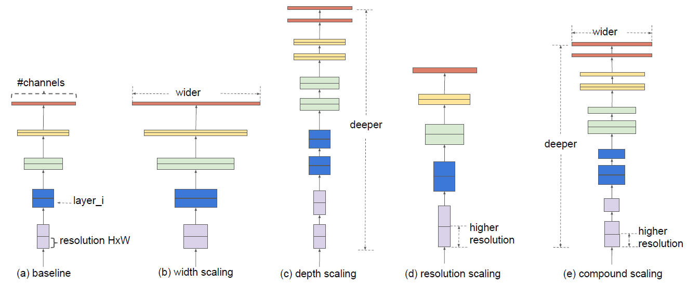
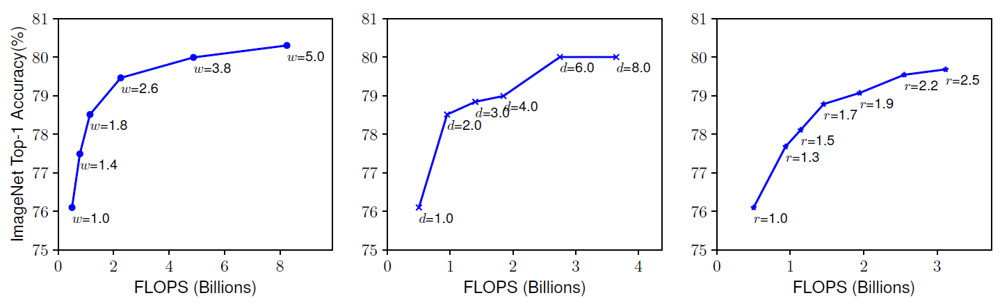
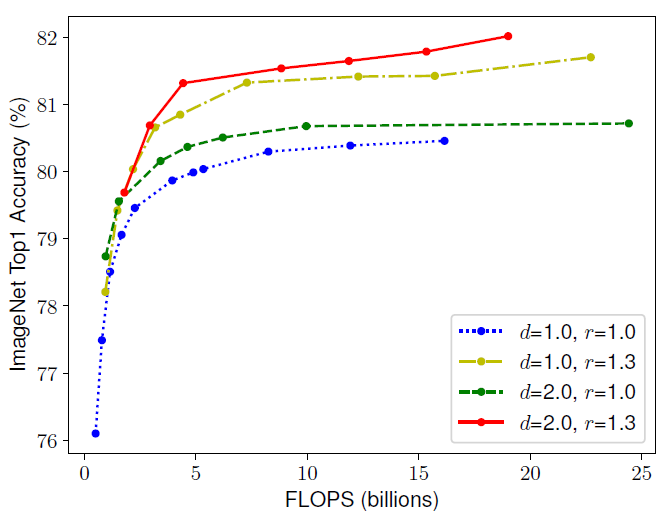
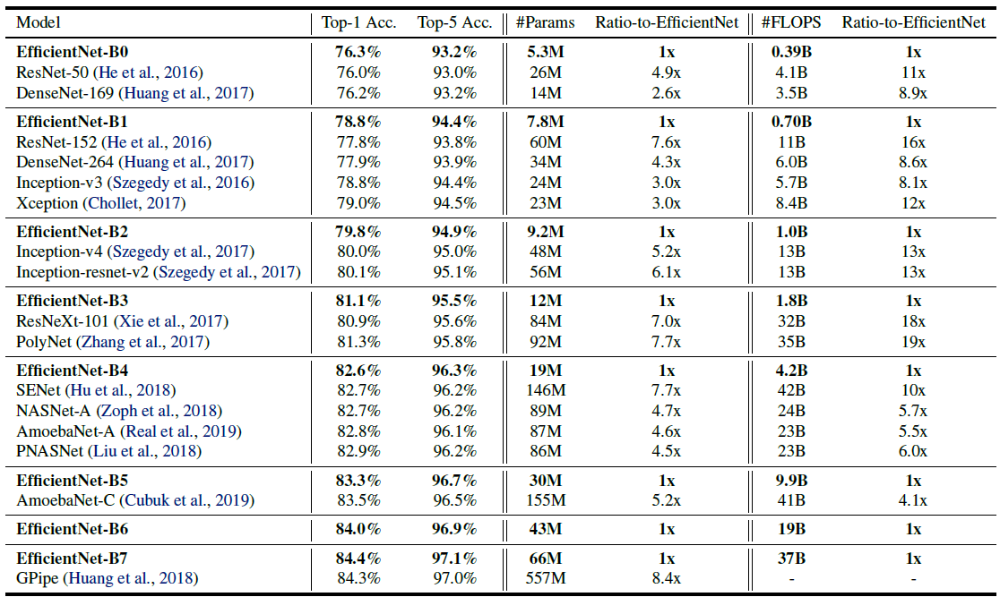

# EfficientNet: Rethinking Model Scaling for Convolutional Neural Networks

增加模型精度的方法有增加网络的深度，特征图的通道数以及分辨率（如下图a-d所示）。这篇文章研究了模型缩放，发现仔细平衡网络的深度、宽度和分辨率可以获得更好的性能（下图e）。在此基础上，提出了一种新的缩放方法，使用一个简单而高效的复合系数来均匀地标度深度/宽度/分辨率的所有维度，不仅取得了SOTA，而且参数更少，计算复杂度更低。

一个卷积层$i$可以定义为$Y_{i}=\mathcal{F}_{i}\left(X_{i}\right)$，其中$\mathcal{F}_{i}$是操作符，$X_i$是输入张量，形状大小为$\left\langle H_{i}, W_{i}, C_{i}\right\rangle$（简单起见，没有引入batchsize），$Y_i$是输出张量，所以一个卷积网络$\mathcal{N}$可以表示为一系列层的组合：
$$
\mathcal{N}=\mathcal{F}_{k} \odot \ldots \odot \mathcal{F}_{2} \odot \mathcal{F}_{1}\left(X_{1}\right)=\odot_{j=1 \ldots k} \mathcal{F}_{j}\left(X_{1}\right)
$$
卷积神经网络（如resnet）通常是被分为多个stage的，一个stage的所有层共享相同的结构。因此，上述公式可以变换为：
$$
\mathcal{N}=\bigodot_{i=1 \dots s} \mathcal{F}_{i}^{L_{i}}\left(X_{\left\langle H_{i}, W_{i}, C_{i}\right\rangle}\right)
$$
其中$\mathcal{F}_{i}^{L_{i}}$表示的是层$F_i$在$stage$ $i$重复了$L_i$次，$\left\langle H_{i}, W_{i}, C_{i}\right\rangle$是第$i$层的输入。根据上面的定义，这篇文章的目标可以抽象成如下公式：
$$
\begin{array}{l}{\max _{d, w, r} \quad \operatorname{Accuracy}(\mathcal{N}(d, w, r))} \\ {\text {s.t.} \quad \mathcal{N}(d, w, r)=\bigoplus_{i=1 \ldots s} \hat{\mathcal{F}}_{i}^{d \cdot \hat{L}_{i}}\left(X_{\left\langle r \cdot \hat{H}_{i}, r \cdot \hat{W}_{i}, w \cdot \hat{C}_{i}\right\rangle}\right)} \\ {\text { Memory }(\mathcal{N}) \leq \text { target-memory }} \\ {\text { FLOPS }(\mathcal{N}) \leq \text { target flops }}\end{array}
$$
搜索最优的$d, w, r$，使精确度最高，并且参数量以及运算复杂度不超过目标量。

网络深度越深，可以抓取更丰富更复杂的特征，泛化得更好，通道数和分辨率放大，可以抓取更精细化的特征，更好训练。通常是单一的缩放三个中的一个变量，单一扩展网络宽度、深度或分辨率的任何维度都可以提高精度，但是对于更大的模型，精度增益会降低。如下图所示：

文章观察到网络的深度，特征图的通道数以及分辨率三者是互相依赖的，比如，对于更高分辨率的图像而言，我们应该要提高网络深度，这样才会让更大的感受野帮网络在更大图像的更多像素中抓取到相似的特征，同时也应该提高通道数，抓取大图像的更精细的特征。同样，作者也用实验验证了这一点，如下图所示：

第一个基线网络(d=1.0, r=1.0)有18个卷积层，分辨率为224x224，而最后一个基线(d=2.0, r=1.3)有36层，分辨率为299x299。所以为了追求更高的精度和效率，在ConvNet缩放过程中平衡网络宽度、深度和分辨率的所有维度是至关重要的。

现在来介绍作者提出的方法——复合缩放（compound scaling），该方法使用了一个复合参数$\phi$有原则性地均匀缩放网络深度，宽度以及分辨率。如下公式如示：
$$
\begin{aligned} \text { depth: } d &=\alpha^{\phi} \\ \text { width: } w &=\beta^{\phi} \\ \text { resolution: } r &=\gamma^{\phi} \\ \text { s.t. } \alpha & \cdot \beta^{2} \cdot \gamma^{2} \approx 2 \\ & \alpha \geq 1, \beta \geq 1, \gamma \geq 1 \end{aligned}
$$
$\alpha, \beta, \gamma$皆为常量，可以在很小的栅格中进行搜索，$\phi$可以由用户定义控制资源的缩放因子，加倍网络深度将加倍**FLOPS**，但加倍网络宽度或分辨率将使**FLOPS**增加四倍，所以这里的$\beta, \gamma$取的平方，保持三者对于**FLOPS**的权重是一样的。最终总的**FLOPS**等于$\left(\alpha \cdot \beta^{2} \cdot \gamma^{2}\right)^{\phi}$，即为$2^\phi$。

复合缩放的方法分为两步：

- 第一步：固定$\phi$为1，这时候的网络（作者命名为EfficientNet-B0）不是很深，对这个网络利用公式2和3对$\alpha, \beta, \gamma$进行搜索，找到最优值。
- 第二步：固定$\alpha, \beta, \gamma$为常数，使用不同$\phi$的公式3放大EfficientNet-B0，依次得到EfficientNet-B1至B7。

看似简单，但效果极佳，各个模型的性能表如下：

可以看到是又小又快，精度还高，很棒。